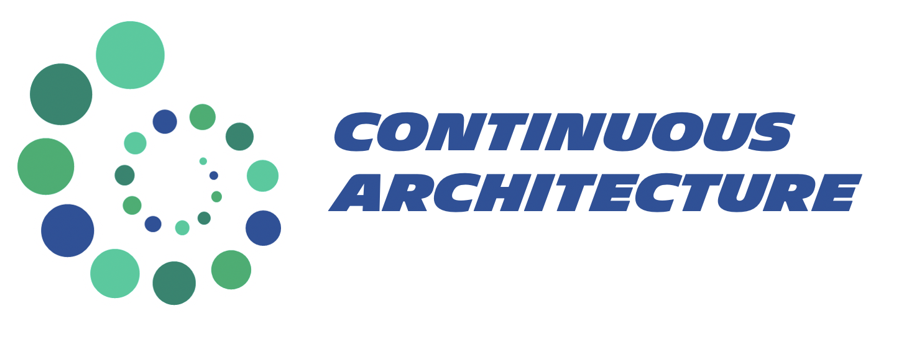

# Continuous-Architecture-Toolkit

## Description

[pending] To complete.

## How to contribute

[pending] To complete.

## License

Continuous architecture materials are distributed under Apache License 2.0 apart from some illustrations which are distributed under Ceative Common Attribution ShareAlike 4.0 International License. Please, refer to the LICENSE file for further information.

## Authors

Continuous architecture toolkit was initially developed by Michelin & Gluendo to setup an agile architecture operating model and to support the Michelin digital journey.

They were quickly joined by a small group of enthusiasts from DXC and Société Générale sharing the same ideas about the evolution of architecture in the world of information system design and this project is now maintains by the following core group of people:

* @tfraudet
* @ojauze
* [pending] To complete.
* ...
