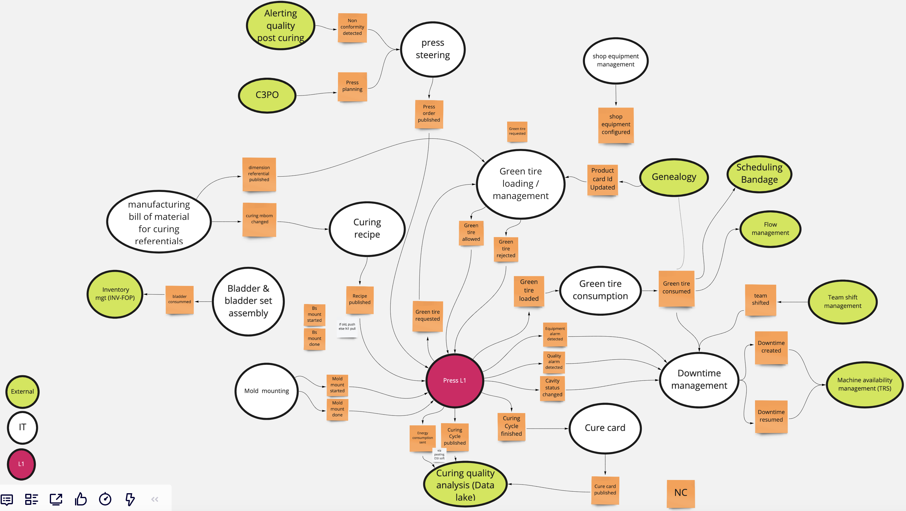
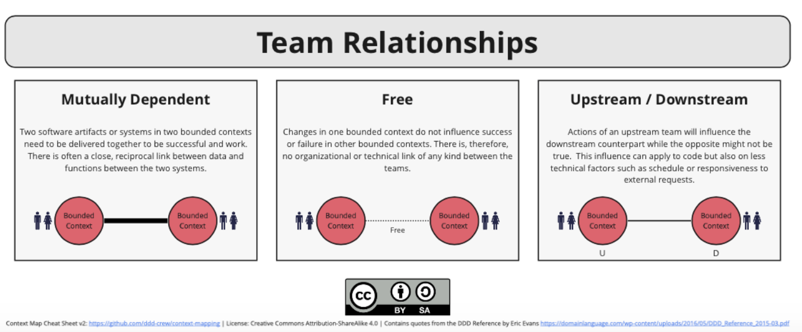
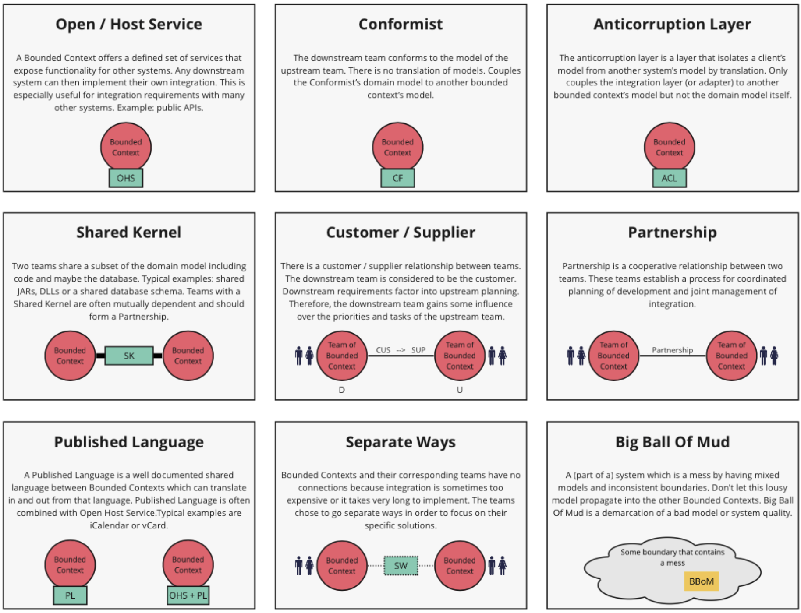
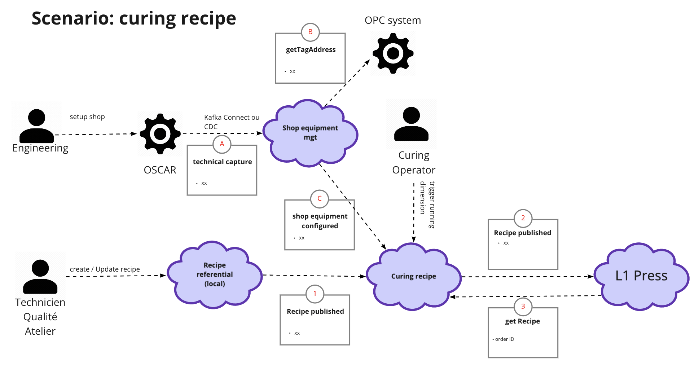

:icons: font

# A case study from the industry to see how Domain Driven Design can be used

https://en.wikipedia.org/wiki/Domain-driven_design[Domain Driven Design] is set of concepts and practices aiming to align the structure and language of the software code with the business domain the code is supporting. It was popularized by Eric Evans and gets lots of traction in the last couple of years. One of the main difficuties when you're trying to adopt DDD to model and design your solution is "Where the hell should I start from?"

We wrote this case study, inspired by a real use case, to present one approach to apply Domain Driven Design if you are an architect trying to design your product. We do not pretend that this approach is the only one but it may be a usefull guideline. 

## Background and context

In the tyre industry, we do make tyres by cooking or curing a raw tyre, so-called green tyre (which is an assembly of rubber and metallic layers). This process takes place in plants in the curing shop where press lines composed of press machines are steered in parallel by an information system. From a high level standpoint, the curing process is quite simple. Before being able to cure a given tyre dimension on one or some presses, we need to push the curing recipe to the press(es) and assemble and mount the tooling (mold and bladder set) inside a given press. The first green tyre is then consumed by the press which is pushing information all along the curing cycle. Once this cycle is finished, the final curing information are received so we can control the quality of the curing, create non conformities if any, and create the curing card (birth certificate for a tyre if you will). Then the next green tyre is called by the press. Of course, the press keeps sending monitoring information of its own state so any issues or downtime can be identified.

## How did we applied DDD in this context?

### Explore your domain with an Event Storming

Before getting to the architecture work, you need to start modelling your business domain. In this case, the curing of tyres. A good practice to start with is an Event storming as the objective of an event storming is to explore the domain by putting domain events on sticky notes along a timeline. In other words, how would you describe your business domain with a set of business events? An Event storming is a workshop in which business experts, architects, analysts and developers collaborate to describe the business domains around the main business events. A domain event activates a policy that will issue a command / action from a system and this action will produce another event. Through a set of post its with different colors, the working describes the sequence of events. And there are two important things to keep in mind when doing such workshop: 

* you must be very explicit and non ambiguous on the terms you're using. Everyone in the group must be confortable with the terms you're using. This set of terms is what we call the ubiquitous language.
* you are not designing your solution but discovering the business domain you're working on. Don't go too deep into the technical details. That's not the point yet.

You'll find below the event storming we did for our domain using the Miro tool.

image::./img/event_storming.png[Event storming]

It represents the curing process but in a much more details way.

### Decompose your domain into bounded contexts

Once the event storming was done, it's the right time to use it to identify the different bounded contexts of your domain. These contexts simplify the architecture of your system by separating the concerns. They also help to create autonomy as eah of them can evolve at different pace without impacting the others. Among other things, they enable the technical partitioning: each context can have a specific and suited technical stack, they can scale differently. This technical partionning can influence the organizational partionning: we may assign autonomous teams on these contexts and promote parallel working.

There is no easy recipe to identify your contexts and decompose your domain. But the below figure list some criteria you can use. Some are business (different language, different value streams), others are linked to non functional requirements (performance, scalability ...) and in some cases a different rate of change can also be used.

image::./img/context_decomposition.png[Context decomposition]

We used these criteria to identify our contexts. We ended up with 3 types of contexts: 

* supporting contexts: providing referential data (bill of material, recipe ...), managing shop equipments and toolings (bladder sets and molds)
* core contexts: loading green tyres in the press, consuming greentires, create the cure cards, manage downtimes ...
** we only find one context for the press machine. It's a kind of monolith in a sense but we did not have the choice there. Indeed, given the way machine softwares are developed there was no way for us to decompose this big context into smaller pieces. It's a unit of deployment.
* external contexts: context that are outside of the business domain and with which we have to communicate

Once identified, the next steps is to highlight the business events generated by one context and consumed by others. We call them pivotal events. The below figures shows the result of this exercise

### Defining the coupling between context with a context map

Even if the goal of a bounded contexts is to provide autonomy, you stil have some dependencies between them. The purpose of the context map is to give a holistic overview with regards to coupling of bounded contexts and ultimately between teams. The Context Maps tool describes the contract between bounded contexts & teams with a collection of patterns. There are nine context map patterns and three different team relationships. 

Let's start with the team relationship. If we keep in mind that there could be one team behind each context (even if a team can be in charge of several contexts in some case), you can classify the relationship between teams in three category: free (meaning no relationship), mutually depedend (these contexts need to be delivered together to be sucessful and work) or upstream / downstream (actions of an upstream context influence the downstream one while the opposite may not be the case). The below figure ^ref1^ illustrates these 3 types:

Once the relations between contexts are clearly identified, you need to define which patterns characterise best these relationships. There are nine integration pattern as depicted in the below figure ^ref1^:

^ref1^ courtesy from http://github.com/ddd-crew/bounded-context-canvas[ddd crew]

This exercise is extremly usefull to define your dependencies with other teams (ie between your contexts and external ones) and how you want to shape these relationships. 

When you are in a upstream-downstream relationship, we often use this simple decision tree to help you define the pattern you should be using:

* ``if`` you are dealing with a language that is standardized across your domain or maybe beyond (up to your company), you should select the "published language" pattern. 
** The "Open/host service" pattern is often used in combination especially if you are implementing APIs. The format of the API is the "Published Language" and the "Open/Host service" indicates you are exposing this service to other. It is also valid for an event driven approach as it can be considered as an asynchronous API.
* ``else if`` the downstream context is considered as the customer meaning their requirements are considered by the upstream context, then choose the "Customer / Supplier" pattern
* ``else if`` the "anticorruption layer" should be prefered. The downstream context consumed the event or API provided by the upstream context but implement a transformation layer to prevent the upstream context language to invade (or corrupt) the downstream context

It means we do recommend to *avoid* if possible the "Shared kernel", "Partnership" and "Conformist" patterns as they introduce strong dependencies between contexts. Of course, there could be cases where it makes sense but it should ring a bell in your mind. Do I really want such dependencies?

The below figures is the contexts map for our use cases. Here are the main decisions we took to end up with such map:

* Shop equipment and teams shift were two contexts the company decided to standardize accross the different plants. As such it made sense to conform to them as there was a strong willingness to standardize.
* The machine availabilty performance is a standard in the industry (called https://fr.wikipedia.org/wiki/Taux_de_rendement_synthétique[TRS]) and consumed downtimes. The "Published Language" seems to be a good fit as we wanted all shops (curing and others) to published downtimes in the same manner. 
* The cure card is an event that is consumed by many other contexts (internal & external). Once again the Published Language made sense. 
* We adopted as much as possible the Anticorruption Layer pattern to avoid corrupting our bounded contexts with lanaguage coming from other contexts.
* We had one case where Customer / Supplier was chosen. Inventories of bladders are managed in accounting books leading to an integration with our ERP system. The ERP was considered the customer and our bladder context had to consider the ERP requirements.

image::./img/contexts_map.png[Contexts map]

### Describing in detail your contexts

The next stop in your DDD journey could be to describe the roles and responsibilities of your bounded contexts. Why? Before committing to architectural choices that are hard to change, we have to consider essential trade-offs that can have a significant impact later on your product development. The Bounded Context Canvas forces you to answer a series of questions about the design of a single bounded context that you should consider before committing to an architecture, team structure, or writing the code.  How can you characterise the behaviour of this context? Does it receive high volumes of data and crunch them into insights - an analysis context? Or does it enforce a workflow - an execution context? Identifying the different roles a context plays can help to avoid coupling responsibilities.

The canvas we used is a mix of visual representation and written text. 

* The left part is used to describre the inbound communication initiated by other collaborators. _Messages_ are the information that one collaborator sends to another. There are three types of conversation that can occur between bounded contexts. A request to do something (a command), a request for some information (a query), or notification that something has happened (an event). _Collaborators_ are other systems or sub-systems that send messages to this context. They can be other bounded contexts, frontends (web or mobile), or something else.
* The right part is then dedicated to uutbound communications initiated by this context to interact with other collaborators. The same message types and notations apply as inbound communication.
* In the middle one finds 
** the ubiquitous Language: what are the key domain terms that exist within this context, and what do they mean?
** Business Decisions: What are the key business rules and policies within this context?

The below figure is the "Curing recipe" bounded context description:

image::./img/context_canvas.png[Context Canvas]

### Describe the end to end dynamic

The bounded context canvas is a great tool to detail each of your contexts and foster to think about modularity. But it has a main drawback: you're loosing the end to end view and the link with end user needs. That's why we propose you to complete the journey using the scenario tool. We usually starts from an end user journey and describe the sequence of tasks and events that this scenario will trigger accross several bounded contexts. This last step is also an opportunity to check the coherence of the system.

You'll find below the result of this practice on the curing recipe journey.

## Additional reflexions

Once more, we would like to recall that this approach is one way of applying Domain Driven Design. It's not the truth and there could be other ways depending on your context. We stronly encourage you to adapt it if you think what we're proposing does not fit your context or constraints.

It's also interesting to reflect a minute on the approach itself. DDD can be applied to design a product with a set of bounded contexts within the boundaries of your product. That's what we describe in this article. But it can also be used at higher level for a large business domain. The approach will be slightly adapted in that case but most of what we describe will be quite similar. Only the level of granularity will be different. When you're operating at a product level, the core context represents the different micro/macro services that will compose it. But when you're describing an entire business domain, these bounded contexts may represent products that could be describe using DDD.
