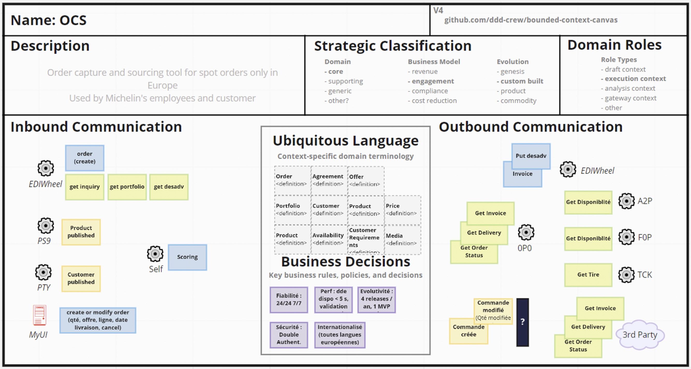

# Context and background

Several years ago, we revisited our information system supporting order to cash processes. We used to have a legacy monolith (hosted on a mainframe) and supporting most of these processes. We decided to adopt a best of breed approach: several solutions were implemented to support the different part of these end to end processes: from order capture to transportation optimization up to logistic delivery ... This move, helped us to

* source the best software to support a subset of our process
* start decomposing our monolith enabling to change part of our proceses at difference pace.

As soon as you have several systems contributing, you need a central component to ensure the overall execution and in our case it was a central orchestrator (a business process management tool). It steers the execution of these processes and deals with different objects granularity. That may sound a silly problem but we do not manipulate the same object all along the execution of our processes. A customer order may have 3 lines (1 per item) that will be split for transport optimization into 4 lines (1 customer order line being sent in two truck loads for instance). Last but not leasst, there was also a belief that we had to introduce this orchestrator because the team building the contributing applications lost the knowledge of which business rules they have to implement. It manifested into the creation of this team in charge of the orchestrator and enforcing those rules. 

After several years, we saw different issues rising with this approach especially around the orchestrator

. It became a single point of failure. When the orchestrator was down, we had a direct impact on our deliveries to our customers 
. It became a sort of monolith very difficult to maintain over time. We ended up having around 20 processes deployed in this BPM engine and we could not modify some of them without having to re-test everything for instance. 

## Our journey

So, we decided to re-think our architecture around the concept of events and their choregraphy as we wanted to get rid of this orchestrator. And we'll explain how we did it. The approach we took, look at it as a recipe we tried but keep in mind we don't pretend to be a three star restaurant ;) 

As you probably already guessed, we used the Domain Driven Design approach for this architecture re-factor. We know there are different ways to practice DDD and it can depend on the state where you start from, the assets you already have ... Below we'll describe the different steps we went through.

## It all starts with the domain boundaries

Here we talk about the Order to cash domain and we had to define its boundaries (even if it was from a very high level perpective). The context starts with the capture of sales orders by customers and goes up to the payment of the invoice. The working group decided to take an hypothesis: processes to ensure we have the goods/products at the right time and at right moment and how to allocate our inventory to customers were considered out of scope. They belong to other domains with which we have relationships.

## An event storming to discover the domain through the prism of business events

The event storming practice is often very useful to discover your domain. But in our case, even if we started by describing the process, we quickly focused our effort on the information passed all along the process. By sharing the execution of the process it made it possible to highlight the information granularity we have to deal with at each step as well as the temporality of events:

. The order line created by customers is not the order line we have to execute. Indeed, depending on where we source the products (which inventory warehouse), their availability and the possible delivery dates, the quantity requested by the customer can be split on several lines or even be reduced (total quantity is not available at the date requested by the customer).
. A customer delivery groups together different lines of orders fullfilled by products leaving from the same warehouse and for which we committed on a delivery date.
. Reception at the customer's premises is done at truck level as we group different delivery lines in the same transport unit. 
. A customer invoice groups together different delivery lines (not necessarily delivered in the same truck) with identical payment terms (with 1 or more payment dates)
. A payment groups together different invoices (total or partial) to be paid on the same date.

The below figure illustrate the different objects we're dealing with, their granularity and how they are interconnected.

image::./img/object_granularity.png[Object granularity]

This granularity changes and the associated vocabulary (ie the ubiquitous language) helped the workgroup to decompose our domain into 3 sub domains: customer orders, customer deliveries and customer invoices.

Sub-domains often have a dependencies and in that case, we defined for each relation which sub-domain is upstream to the other. The nature of the relation is also very important and to qualify it we used strategic integration pattern. There are nine patterns and in our case we ended up using only 4: the confirmist, anticorruption layer, open host service and event published. The domain along with its sub-domains for which relations are defined through integration patterns is what we call a context map. And below, you'll find the figure for our case.

image::./img/o2c_domain.png[O2C domain]

As you can notice on the figure, not only we have the domain described in the system context map, but we also find the teams realizing the domain. That's the team context map. Mapping teams is usefull to identify some inconsistency like several teams working on a domain for instance. It's maybe not a good idea or at least it should ring a bell in your mind.

## But wait a minute, you mentionned an event storming and there is no business events yet. 

Indeed, during the previous phase, we changed our mind and described the objects we had to manipulate. But to complete the approach, we had to execute the famous event storming. The figure below is the result of this session.

image::./img/event_storming_O2C.jpg[O2C event storming]

The red post-its represent the main business events of the domain and visually you can see the sequence of events. You can regoznise two of the sub-domains we mentionned before: Customer Order and Customer deliveries. We also grouped events by the application receiving them. 

## You're ready to dive into some implementation details

As the event storming is used to discover and describe a business domain, it has very few IS/IT details. So it's quite common to descrive this events chain in a more "technical" manner. An IT event storming helps to highlight the information expected by each solution, the need to store this information or to request it, the data & APIs made available and the events carried out.

Here, you have to remember that our objective was to implement an event driven architecture. It is quite common to rely on technologies such as Kafka to support it. One of the central concept of Kafka (or similar technology) is the topic. It's the "container" in which you publish and consume your events. The below figure lists the topics we'll beusing.

image::./img/event_storming_it.png[IT event storming]

## The final step of our journey

We have a business domain decomposed into sub-domains and described through main business events. The next and last step for us was to describe each bounded context so we know which events it receive and emit, which APIs it consume and expose and which command it executes. The canvas is especially interesting as it also lists the domain entities or value objects it uses (using the domain ubiquitous language) and the business decisions (rules, policies and decisions) it supports.

