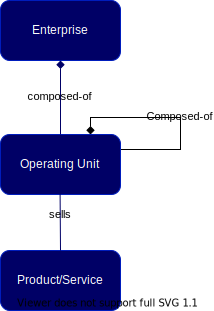

//:sectnums:
//:doctype: book
//:reproducible:

[[enterprise-decomposition]]
==== Enterprise Decomposition
//:toc: preamble
//xref:o-aaf-deployment[o-aaf-deployment-vision]

An enterprise is a complex system. Alongside with Herbert Simon, we argue hierarchy is one of the central structural schemes that the
architect of complexity uses footnote:[The Architecture of Complexity by Herbert A. Simon, Proceedings of the American Philosophical Society,
 Vol. 106, No. 6. (Dec. 12, 1962), pp.467-482.]. By a hierarchic system, or hierarchy, Herbert Simon means a system that is composed of 
interrelated sub-systems, each of the latter being, in turn, hierarchic in structure until we reach some lowest level of elementary
 subsystem. 

Simon observes that etymologically the word "hierarchy" has a narrower meaning in which a sub-system would be subordinated by 
an authority relation to the system it belongs to. Alongside with Simon we will consider systems in which the relations 
among subsystems are more complex than in the formal organizational hierarchy.

Once we agree to model the enterprise as a system composed of sub-systems we have to designate them. In a systems engineering world
using the sub-system terminology is not an issue. In the business world it is. Each of the naming convention carries some baggage. 
For example, if we call the enterprise's sub-systems division, it gives an organizational chart connotation; if we call them Value Areas or 
Domains, it gives an IT modeling connotation.

We will settle for the Operating Unit as defined by Law Insider footnote:[See https://www.lawinsider.com/dictionary/operating-unit]: 
for any fiscal year Operating Unit shall mean a division, Company subsidiary, group, product line or product line grouping for which
 an income statement reflecting sales and operating income is produced.

The diagram below represents the decomposition of the enterprise into one or more Operating Units. Each Operating Unit can be decomposed
recursively into one or more Operating Units. The generic meaning given to Operating Unit gives the flexibility to designate sub-systems using 
the enterprise's specific terminology. For example a retail bank composed of a distribution network and a set of back-offices. 
The distribution network is organized into groups of branches by territory and large enterprises are managed into portfolios by industry sectors.

Operating Units sell the products or services to external or internal clients. 

link:framework.html[Return to the CAF diagram]