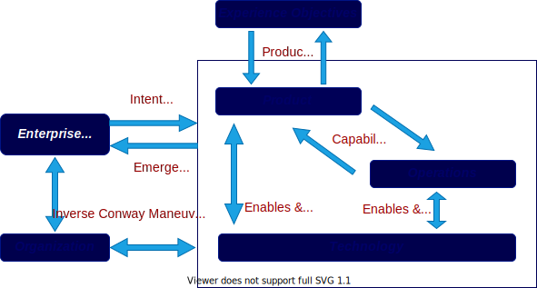

//:sectnums:
//:doctype: book
//:reproducible:

//[[framework]]
=== Continuous Architecture Framework (CAF)
By Frédéric Lé and Jean-Pierre Le Cam
//:toc: preamble
//xref:o-aaf-deployment[o-aaf-deployment-vision]

The Continuous Architecture Framework or CAF is organized into six related views as depicted in the figure below.

To navigate the framework, click on rectangles that represent framework views.

Though the CAF perspectives are related, the diagram should not be interpreted as a waterfall process model. 
The activities of the framework are executed in a continuous manner. 
A balance between intentional architecture and emergent design helps better manage the uncertainty and complexity
 that characterizes the digital journey of the enterprise.

The questions below drive the navigation between the views of the framework:

* How to decompose the enterprise?
* Can we achieve product market fit?
* Do we need to improve our operational capabilities?
* How can technology enable and augment our products and capabilities?
* How can we design a truly agile organization?

//include::experience-objectives.adoc[]
//include::product.adoc[]
//include::enterprise-decomposition.adoc[]

link:https://continuous-architecture.org/[Return to the CA Toolkit overview]