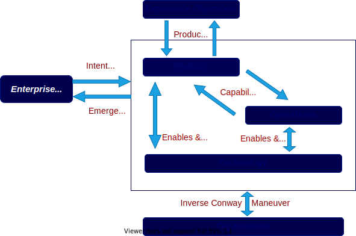

//:sectnums:
//:doctype: book
//:reproducible:

//[[framework]]
=== Continuous Architecture Framework (CAF)
By Frédéric Lé and Jean-Pierre Le Cam
//:toc: preamble
//xref:o-aaf-deployment[o-aaf-deployment-vision]

The Continuous Architecture Framework or CAF is organized into six related views as depicted in the figure below.

include::experience-objectives.adoc[]

