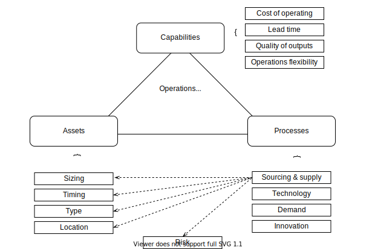

//:sectnums:
//:doctype: book
//:reproducible:

[[operations]]
==== Operations
//:toc: preamble
//xref:o-aaf-deployment[o-aaf-deployment-vision]

In a recent article footnote:[Why Do So Many Strategies Fail? Leaders focus on the parts rather than the whole by David J. Collis From the hbr.org, July–August 2021], David J. Collis observes CEOs in innovative enterprises often neglect to invest in capabilities needed to sustain a long-term competitive advantage. The _Operations View_ addresses this shortcoming by shaping the enterprise's resources and processes to create the needed capabilities. The CAF starts from the *Value Capability Assets Processes* (or VCAP) framework footnote:[Operations Strategy: Principles and Practice by Jan A. Van Mieghem and Gad Allon, 2nd edition, 2015] and extend it to address _Digital Operations_. 

The Operations View covers the ensemble of _Assets_ and _Processes_ of the enterprise. It affects what the _Operating System_ of the enterprise can or cannot do. Together with the concept of _Value_, it determines the _Capabilities_ of the enterprise. The _Capability_ perspective treats the Operating System as a black box and focuses on the desired and actual dimensions along which it excels (or not). 

_Values_ are the third factor that affects what the Operating System can or cannot do. Values are the standards by which employees set priorities and behave. For example when an enterprise values service employees' autonomy, it is more capable of solving customer problems compared to one where employees follow procedures blindly.

The figure below, inspired by the VCAP framework, summarizes the dimension to consider when assessing the current situation and formulating an _Operations Strategy_.

[[classical-operations-strategy]]
===== Classical Operations

The capabilities required to deliver the products the enterprise markets define:

* The cost of operating that must be achieved for the product to be profitable. Because price is set by the market, design to cost is a common approach to develop products and their production processes
* The lead time which determines how long it takes to serve customers and how much they have to wait
* The quality of outputs determines the expected degree of excellence of products and processes 
* Operations flexibility determines the expected ability of the enterprise to cope with changes in inputs, activity levels or volumes

The asset XXX

[[digital-operations]]
===== Digital Operations

Digital technology provides powerful levers that can help dramatically improve the operational capabilities of the enterprise.

link:framework.html[Return to the CAF diagram]