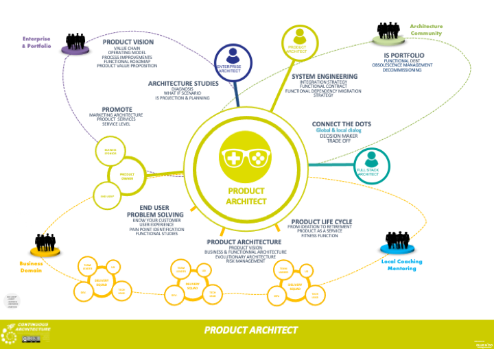

//:sectnums:
//:doctype: book
//:reproducible:

[[architect-roles]]
== Architect Roles
//:toc: preamble

Alongside Yves Caseau we believe _"that architecture in a lean & agile approach is not a specialty reserved for experts but a skill that all team members must possess, at varying levels" footnote:[L’approche lean de la transformation digitale : Du client au code et du code au client, Dunod 2020, ISBN : 978-2-10-081615-6]_

This is why we would like to start by defining what we mean by architecture, see link:what-is-architecture.html[What is architecture?]. This does not mean Continuous Architecture will not define architecture roles, we will do. It implies that we will also describe the architecture dimension of non-architect roles, in particular when those roles have a digital dimension.

=== Abundance of architect roles

For the last 10 years or so, different architect roles raised: enterprise architects, solution architects, infrastructure architects, network architects, integration architects, security architects, data architects ... 

Behind this trend there was the idea that architects roles need to be organize around "layers" which represent IT specialties, and master it from top to bottom. Facing digital world and the need to continuously  delivery modern distributed information systems, this leads to several problems

1. Architects became hyper-specialist in their discipline and lost the perspective of the overall system. ​​​​​​​This very specialized approach did not help to consider all the stacks on which products were built: from deep roots within infrastructure to highly functional layers and lead to take design decisions that are locally optimal but were not as a whole.
2. As more knowledge accrues in one discipline, and people specialize in it more, it becomes harder for inter-disciplinary understanding to happen.
3. It's no surprise that this siloed approach ended up with many architec​​​​​​​ts trying to collaborate on a project increasing needs for communication & synchronization and slow down the decision making process. 
4. Last but not least, architects were mostly staffed outside of teams in a transverse position making it difficult to be really involved within teams.

From a delivery team perspectives, a swarm of architects was melting on them. Each of them with a different perspective, skill set, objectives ... Many of the teams we interviewed told us it could have been a challenge to align everyone on a common vision. With Continuous Architecture, we try to make the life of delivery teams easier and simplify architects roles. 

Our objectives are to:

1. Develop delivery teams judgement regarding architecture to increase their autonomy
2. Develop system thinking (see the whole)
3. Clarify roles and responsibilities between architects, subject matter experts or IT specialists and delivery teams

Sticking to the principle that architects should focus on system as a whole, cross-cutting concerns (breadth) while Designers / Experts / IT Specialist should focus on specialties (depth), we ended up with 3 roles: Enterprise architect, Product architect and Fullstack architect. 

[cols=3*]
|===
|xref:enterprise-architect.adoc[Enterprise Architect]
|xref:product-architect.adoc[Product Architect]
|xref:fullstack-architect.adoc[Fullstack Architect]
| image:./img/enterprise-architect-role.png[Click to enlarge,width=256,link="./img/enterprise-architect-role.png"]
| 
| image:./img/fullstack-architect-role.png[Click to enlarge,width=256,link="./img/fullstack-architect-role.png"]
|===

=== Why only describing three roles?

First, let it be clear: by no means we are saying that all other architect roles do not exist anymore in a way or another but they were not serving our purpose. Let's take several examples:

* network architects: it's an interesting case as the network itself can be considered as a product (a big one though) and as such could have a product architect. But each team nowadays is building distributed systems and as such should consider network when designing its product. Network specialists can be consulted in specific cases when it exceed the skill of the team.
* integration or data architects: while they can be usefull to help teams on these tough topics, they are not staffed within the teams creating a dependency and preventing the teams to take over. 
* security architects: no one can say security does not matter. So what's wrong with having security architects? it's the same problem than with integration architects: you can always rely on an external security specialist to deal with security questions but we do prefer to have teams empowered on this matter and possibly relies on security specialist when it goes beyond their knowledge or expertise.

Do you see a pattern emerging? specialized roles are still usefull either to manage their own product (network, data centers, integration middlewares ...) or to help teams when they are reaching their knowledge & expertise domain. 

While we accept these different specialized roles still exists and are useful, we wanted to insist on three different horizons:

* linking the business strategy & architecture with the Information System: that's the purpose of Enterprise architects.
* designing products to meet end user expectations and fix their problems. The idea here was to focus on the value created by products and the usage from end users. It means a real proximity of the Product Architect with end users and the product owners
* designing the product as a distributed systems. It's the purpose of the Fullstack architect and here we got our inspiration from the fullstack developer.

=== Staff the teams with appropriate skills

Product delivery teams get asked to do a lot of different things, each of which require different skillsets. And as you understood it now, we're asking the team to perform architecture activities too. 

Roles, job positions and persons are different things: 

* A role is a set of activities that needs to be done in a team. 
* A person can have one or more roles depending on the person's skill sets and appetence. We've seen several cases where both Product Architect and Fullstack Architect were fulfilled by the same person. 
* It's perfectly acceptable to have some architecture activities performed by team members
* Depending on the roles a person can take, it defines its job position.