= Architecture for flow case study
:author: Olivier Jauze 
:email: olivier.jauze@michelin.com
:icons: font
:show-toc:

A case study from the industry to see how Domain Driven Design & Team topologies can be used to architect for fast flow

Everyone at some point heard about https://en.wikipedia.org/wiki/Domain-driven_design[Domain Driven Design] and https://teamtopologies.com/[Team topologies]. The first was popularized by Eric Evans more than a decade ago and got lots of traction in the last couple of years. The second is **the** book of the current decade showing how we can structure any IT organization around 4 main team topologies interacting with 3 interactions mode. This case study, inspired by a real use case, presents one approach to apply Domain Driven Design and Team Topologies at the same time to achieve the Architecture for flow state. We do not pretend this approach is the only one but it may be a useful guideline.

## Background and context

Connectivity opens up new opportunities to develop and improve vehicles and mobility services. Intelligent networking, constant data exchange and comprehensive digital solutions will benefit transport and logistics on many levels, ensuring greater efficiency and environmental protection. The use case we are presenting here is a data platform created to support and enable connected mobility use cases. One finds here tire end of life prediction, security offers around connected pressure, tire traceability etc

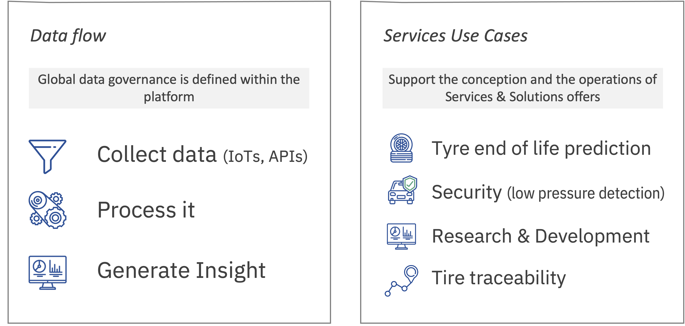

From a data flow perspective, the platform:
 
* Ingests data coming from multiples IoT sensors and external data sources
* Process by applying quality rules and enrichment
* Produce insights using AI augmented capabilities for customers. These insights are then packaged into offers directly sold to customers
* Expose data sets and APIs for exploration purposes so we keep fueling the service offers with new insights we discover along the way.

The technology stack in used is mainly based on PaaS (Platform as a Service) services supporting the above main functions as depicted in the below figure.

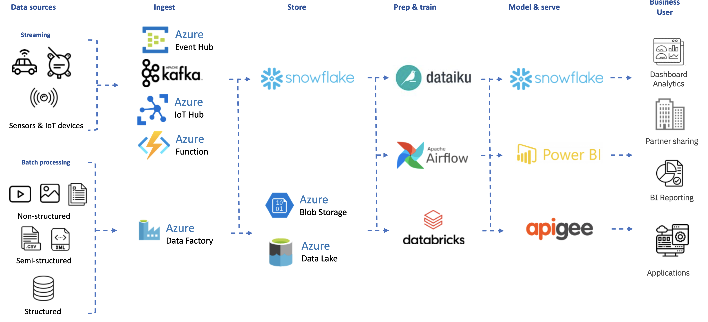

In terms of metrics, the below figures illustrates the size of this initiative:

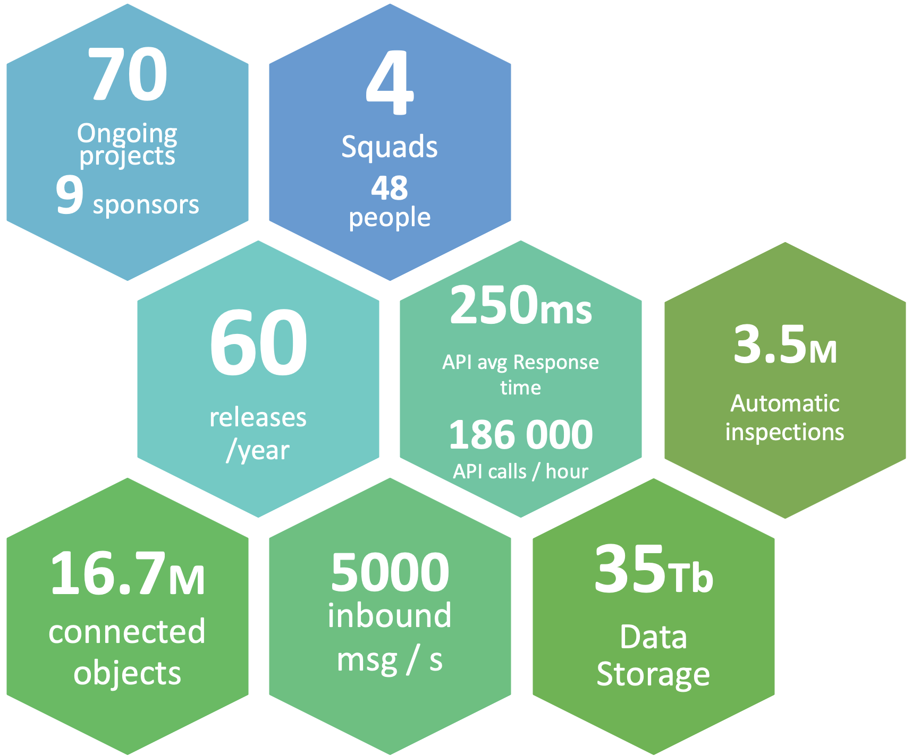

The team building and running this platform was organized using a very specific team topology: supposedly stream aligned teams collaborating on the same product (ie a git repository) and a complex system team in charge of a very specific component.

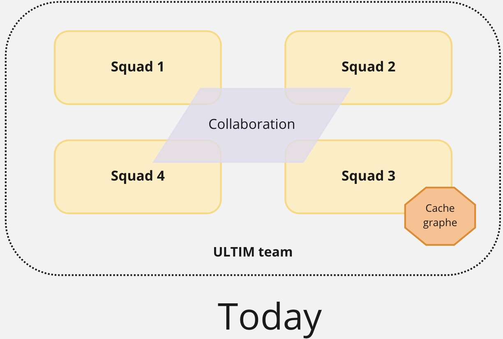

This team was from the beginning in a product approach mode with the "You Build It, You Run It" mindset. According to the famous Accelerate metrics (lead time, deployment frequency, meantime to restore & change fail), that team was considered "medium performer" with an average of 1.1 deployment a week, 4 weeks lead time, 4h MTTR and 15% change fail.

Over time we started to notice a slow degradation of that performance. It was small but regular. It materialized with a first syndrome. The number of Work In Progress items in the backlog kept increasing reaching the very high number of 51. As reference, we consider that 3-4 per team is a market norm. Inevitably, the lead time metrics deteriorated. At some point, the team was so overloaded that a second syndrome appeared. I called it "it's not in my scope". Given the number of in progress items, the team developed a self-preserving reaction: I don't want to increase my burden so I am pushing this problem to someone else (even if the topic was indeed in their scope).

This team moved from medium to low performer in about a year. In parallel, the work that should have been done by this team was now handled by others.

## Understanding the problems first

We've been through different diagnosis sessions with the team to deep dive on the different issues. 

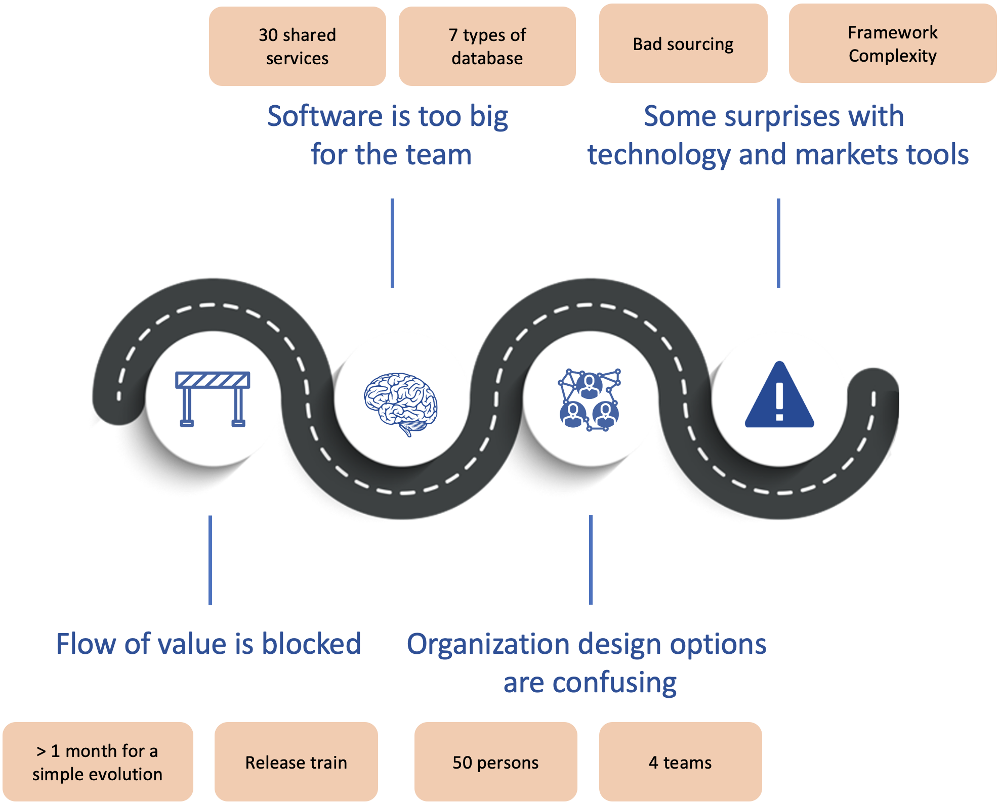

The first set of problems we outlined is related to the flow of value being blocked:

* This data platform was build by 4 sub-teams all collaborating on the same product (ie git repository). A new topic added in the backlog was first investigated by transverse persons (architects, solution consultant and devops) before being assigned to one of the four sub-teams. This generated a bottleneck and stories accumulated in the pipeline before getting assigned to teams. Long story short: we spent more time grooming and assigning user stories than working on them. 
* We also noticed a lack of autonomy between the sub-teams: more than half of the topics required contribution from other teams. 
* The concept of releases train introduced dependencies as each teams had to coordinate deployments on given dates.

There was also architecture and technologies problems: 

* Despite using the micro-services architectural style, the data platform was delivered as a monolith with 30 shared services. It means that once a user story was affected to a team, it was more than likely to impact a big part of that monolith generating huge upfront deep analysis and regression tests once built. 
* The number of technologies in use was too high to be mastered by a team. For instance, we had 7 data base technologies. Our technical diversity was not mastered anymore.
* Several technologies or frameworks choices did not met expectations and introduced complexities.

At some point, the team kept re-organizing itself, trying to find solutions through the organization without looking at the problem holistically. Looking at our ambitions in this domain, we had to fix these issues but also to scale this solution so we can support more and more services offers and exploration topics at the same time.

## The approach we took

We decided to step back and see the global picture (systemic view): 

1. We were loosing time in upstream phases with user stories grooming and team assignment as well as downstream phases with a lot of testing.
2. Teams were slow downed by a lack of autonomy in both building and deploying their products. 

We looked into the Continuous Architecture toolbox to see what was available to help that team. Issues around autonomy (ie coupling) and the anti-pattern "Monolith with microservices" were a perfect fit for Domain Driven Design. It became clear, we had to split this monolith and re-think the architecture on business domains. We thought DDD alone was not enough. Changing the architecture without aligning the organization of the teams delivering is doomed to fail as stated in the https://en.wikipedia.org/wiki/Conway%27s_law[Conway's law]. We had to deploy team topologies to make sure architecture and organization matched.

**If you combine DDD and Team topologies all together, you can expect to get a modular architecture with an organization optimized for flow and aligned on the value stream.** Cherry on the cake, in our case, it was also a way to introduce business agility with the capacity to add (or remove) teams depending on the topics you want to add (or stop). You put yourself in a position Amazon knows well: "The bigger we get, the easier it becomes to get bigger."

### Event storming or data domains?

Domain Driven Design often starts with an https://en.wikipedia.org/wiki/Event_storming[event storming] workshop to better understand the business domain. Using business events to tell the story of a domain and then grouping them in bounded contexts is usually a first good step toward a monolith decomposition. The nature of what this team was doing pushed us to adopt a different approach. It was not possible to describe our data platform using events. First because not everything is event based. Second, the team was managing very different subjects. We tried to use different heuristics to decompose our connected mobility domain: value stream, end users and Service Level Agreement (SLA).

We reviewed our initiative portfolio and ended up with four identified bounded contexts: 

* We do have an offer for mining customers to better manage their tire reforecast for big jumper trucks. The customer pain we were trying to address was how to avoid a tire shortage that could lead to trucks outage costing a fortune to the mine. It was clear, we could create a team focusing on this value stream.  
* Couples of service offers rely on a set of algorithms around tire pressure & wear to predict tire end of life, slow leaks ... These algorithms were explored, built and tuned by a very specific user persona: data scientists. We thought we could create a team to provide the capabilities for these end users.
* There was initiatives around the tire lifecycle. Here by tire we mean the individual asset not sku/product. We first though we could create a Tire lifecycle domain to mutualize the knowledge on this business domain. When we dig into this hypothesis, we faced an issue: it was a big domain and with several & very different customers. The services and solutions business line was the first customer: they needed to have a complete traceability for each given tire they were managing. This traceability is useful to better predict insights on tires. The second customer was the logistic organization. They wanted to be able to check at the asset level what was loaded in delivery trucks to make sure we were delivering the right tires to our customers. We decided to split this domain in two. The first aggregates all "events" happening to a tire. The logistic domain was a subset of it focusing on logistic events and requiring different concepts like customer invoices, deliveries content ... objects completely irrelevant in the other domain. The final argument that helped us to decide on this split: the criticity of the domains (thus the associated SLA) were different. The below figure illustrates the relationship between these two bounded context:

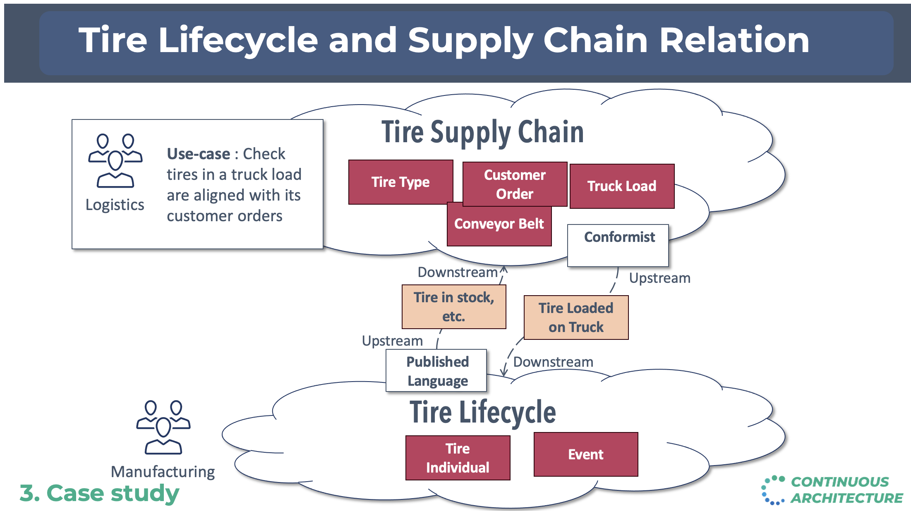

This first round was useful as we identified 4 of the 9 final bounded contexts. But it was not enough as the monolith was not completely decomposed yet. We had to introduce new decomposition criteria to finish the job. We asked ourselves the question: is there some capabilities or data, everyone else in this ecosystem needs? The answer was yes for a very specific topic called Mobility Assets. One finds here vehicles, tires, devices and drivers we do manage in our service offers and the relationship between them. For instance, the vehicle _abc_ has tire _123_ mounted on it and the telematic box _xyz_ installed on. This dataset (some could call a golden record) is extremely useful for most if not all our teams. We decided to create a team in charge of this asset. It would listen to any incoming events, measures or user actions to keep up to date the mobility assets and exposed it to anyone needing it. 

We then reviewed what was still in the monolith: a good portion of it was around Internet Of Things devices. Before the IoT era, we had to deploy technicians on the field to measure: pressure, thread depth, damages on tires, kilometers ... We developed sensors & objects to automate these measures on vehicles and tires. It made sense to create bounded contexts for them. An IoT despite being small is a complete system: from embedded software to monitoring through deploying over the air updates etc. In our case, we had two different IoT: a drive over solution (ie a vehicle driving over the device) and a telematic box installed on trucks & trailers to follow the vehicle location, accelerations ...

The last remaining piece of the monolith can be seen as a datalake. Every other domain we've been through above was ingesting data real time and processing it live to either keep up to date a golden record, create insights or monitor devices. We also needed to store these data in a cold storage so data scientists could discover them, analyze & combine them to develop new capabilities. That was our last bounded context: a datalake storing all our collected data so they can be used by data scientists. 

At the end of these DDD workshops, we ended up with a clear set of domains each having a owner, customers and offers. Our monolith was starting to fall apart.

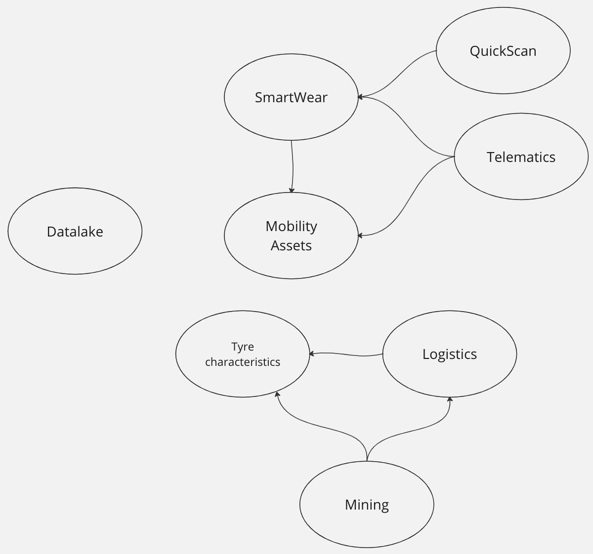

### Team topologies 

We were ready to look at the organization and align it on the architecture. Team topologies advocates that each organization delivering software can be modeled using four team topologies: stream aligned teams, platform teams, enabling teams & complex sub-system teams. The obsession here is to remove every obstacles that could block the flow of delivery. These blockers could be a dependency, a manual check ... That is why starting with a Domain Driven Design approach is really interesting because identified domains tend to be as decoupled as possible.

Out of our DDD workshops, we ended up with domains aligned on:

* _value streams_. Here we find two types of value streams in our context. Business and technical value streams. The best examples of business value streams are the logistic and mining domains. The first makes sure we load the right tire in the right delivery truck. The second was designed to avoid trucks outages in mines. It was natural to map these domains on stream aligned teams. Why? because a stream aligned team is organized around a flow of work for a segment of the business domain and has the ability to deliver value directly to end users. They have their clearly identified end users (served through service offers) and a clear owner. Thanks to the above DDD work, these teams have been defined to be as autonomous as possible from each other. We also have more technical value streams like the data lake. Similar to the software development lifecyle that is a value stream but for IT, a data lake helps to create data products. We decided to create one stream aligned team to manage the data lake and equip data engineers/scientists ... with an appropriate product.
* _an enablement team_ needed by stream aligned teams. We knew stream aligned teams would need similar technical capabilities. There was a difficult choice to make: should we create a platform team to deliver these capabilities or an enabling team? We decided to adopt the enabling team approach because we were not ready to create a platform in a "as a service" mindset. We were more inclined to helps a stream-aligned teams to overcome obstacles while also detects missing technical capabilities or refine the user experience we wanted at the end for them.
* a _platform team_ but not the one we expected upfront. This platform team was not created to deliver technical capabilities. In the connected mobility service, the key golden records everyone needs is the knowledge around vehicles/tires/devices/drivers (what we call mobility asset). We thought creating a platform team to expose this as a service could be beneficial for the whole ecosystem. This platform team is empowered to provide a compelling internal product to accelerate delivery of all Stream-aligned teams.
* a _complex sub-system_ team around the data science. Why? Data science topics are by nature exploratory and requires skills and expertise. If you're a mature organization on Artifical Intelligence, each team will have its own data scientists relying on a data science platform. We were not at this maturity level so we decided to create a data science team mastering the associated skills & technologies to collaborate with the different stream aligned teams when Data science was needed.

We ended-up with the below team topology for this solution. It's important to remember this organization will change over time.

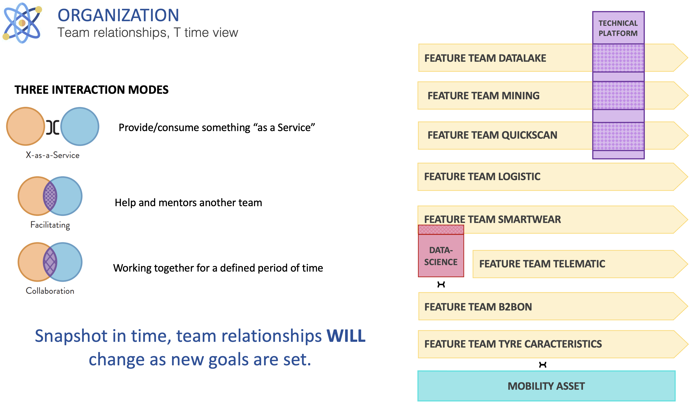

#### Key principles for teams

Each stream aligned team is organized around some key principles:

* 4 to 8 persons per team to keep teams reasonably small
* From build to production in a "You Built It, You Run It" mindset
* Autonomous to release
* Support performed by the Team
* each team must manage its data with a special care on personal information (PI)
* Workload and technical resources should be as isolated as possible
* Architecture evolutions are tracked in xref:../../practices/architecture-decision-records.adoc[Architecture Decision Record] and validated by the architecture team
* Maintaining in operational condition their product (SLA, security ...)

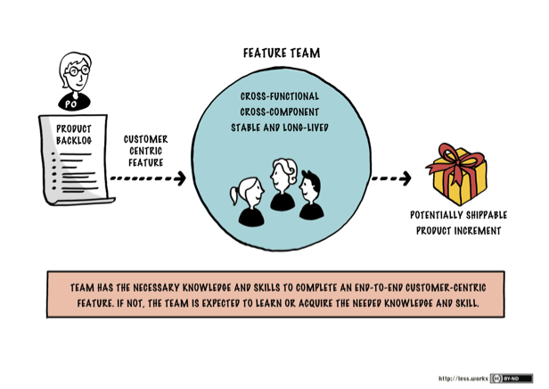

#### An Architecture decision record for each team

Architecture and organization are tightly coupled (as stated in the Conway's law) so it seamed normal to record our decision to create a team in an ADR. Each creation of a team was then preceded by an ADR to explain:

* The functional perimeter of the team
* Golden rules shared by the players (ie teams) of the ecosystem.
* The strategy to remove this piece from the monolith. 
* An architecture overview

To illustrate this, we'll take the example of the mobility asset team and start with its functional perimeter:

* Retrieves referential data from external sources to expose them to other teams. Referential data are Product, Vehicle Types, Models, Brands, Specifications, axle types, companies & locations
* Manage mobility assets and expose them to all other teams: Vehicle, Devices, Tyre, Associations 
* Define and share commons functional keys to resolve the same asset from multiple stream aligned teams.
* Manage associations between assets and store all asset events pushed by all teams without any business rules.

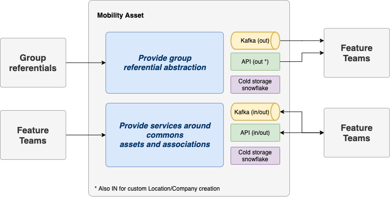

To avoid blocking stream aligned teams, it was decided that each team can choose to:

* Use Mobility Asset and accept the provided SLA if acceptable.
* Manage their assets on their own but reverse them back to mobility asset later.
* When a new integration is required for multiple teams and when Mobility Asset is not yet ready, they can implement the integration themselves and switch to Mobility Asset API once the implementation is done.

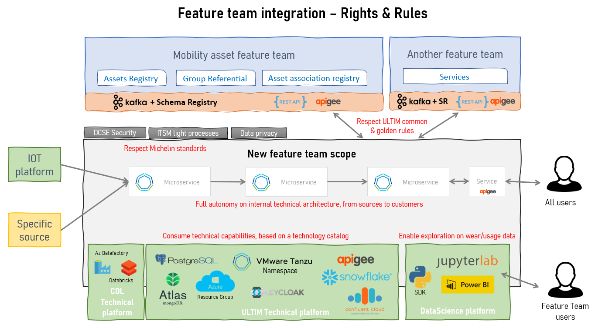

## Did it worked?

Let's put it upfront: it took some time (15 months to be precised) to transform this monolith maintained by four different teams in collaboration mode. The transformation was progressive as we created teams one at a time. What are the results we got from this change?

**Team autonomy** was drastically improved as we defined carefully our domains to reduce dependencies between them. The release train we mentioned above simply disappear giving more freedom for each team to deploy when they need. Dependencies can never be completely removed though. The importance of having clear interfaces' contracts (for APIs, Kafka topics etc) became more important than ever. One of the hard lessons learned is: if you don't communicate well your contracts, regressions will happen and your consumers will be on your back before you know it. Communicate and manage compatibility well or get prepared. 

Breaking down the monolith into smaller products make them easier to understand and master by teams. It can be seen as a simplification lever and a way to **reduce the cognitive load**. The number of customers for a given team got lower (1 maybe 2 for most of teams) bringing clarity and purpose. While before you had dozen of customers to talk to, now teams have 1 or 2 reducing the need to switch from one topic to the other. Cherry on the cake: the governance of the data platform is easier too. Each team is funded by its customer avoiding messy sessions where all stakeholders have to fight to get team availability.

The **"You Build It, You Run It"** approach is clearly a way to make support optimal by avoiding unnecessary transitions and making teams closer to their end users. The level of support can also be defined per team (ie at the offer level) instead of for the whole platform. It did introduce some complexity though as managing build & run activities in a team is not simple. Run activities are critical by nature and take over build activities. How do you preserve your velocity while always being interrupted with run tasks? How do you organize your team to provide a follow the sun support level? It could be controversial but empowering software engineers by putting them on duty make them very aware of the importance of what they they deliver. They will have to fix their own issues at night if the quality of their work is not at the expected level. They will learn fast.

We took the opportunity of this change to introduce **hybrid teams**. We were used to have a business team and a tech team, the first being the customer of the second. A quite traditional way of delivering IT solutions in companies. Traditional but not effective as it introduces an unnecessary distance between business analysts and software engineer not being in the same team. This distance can be seen as blockers on the delivery flow. We decided to staff teams with the skills that were needed wherever they were coming from. A uniq team with one management system and proximity between team members.

The number of transverse people needed to groom topics and ensure a global consistency was drastically reduced. Only a couple of architects remains transverse to make sure some guidelines are well applied (like communicating interface contracts or using this piece of technology). It also means there is no more someone transverse to blame and hide behind. Your team is in charge and empowered. Because transverse people like devops were no longer there, we had to staff them right into teams. We wanted to have focused and dedicated team members so we forbid sharing "people" between teams. It contributed to increase the autonomy of our teams but it had a cost: 10% increase for our teams' size. We had to have software engineers in teams able to perform all activities including devops ones.

Last but not least, we saw an increase in **business agility**. The https://theleanstartup.com[Lean Startup] methodology is advocating, among other things, to explore the market fit for your product (in our case a service offer). It means being able to create quickly Most Valuable Products to test hypothesis, get feedback and possibly adjust the course. Thanks to this change, we are now able to create teams to explore a topic on demand. As a matter of fact, we reverse the pressure as now business agility and speed are tight to our capacity to fund a new team. Agility also means we have sometime to shutdown a team when the market fit is not proven. The overall ecosystem is not disturbed that much.

## Are we done?

Of course not. We re-architected our monolith to make it modular and adapted the organization to it. One thing is sure: we can take for granted. New exploration topics or services offers will emerge, some will disappear etc. The architecture and the organization will have to be adapted continuously but with the Continuous Architecture toolkit, we are well prepared.
