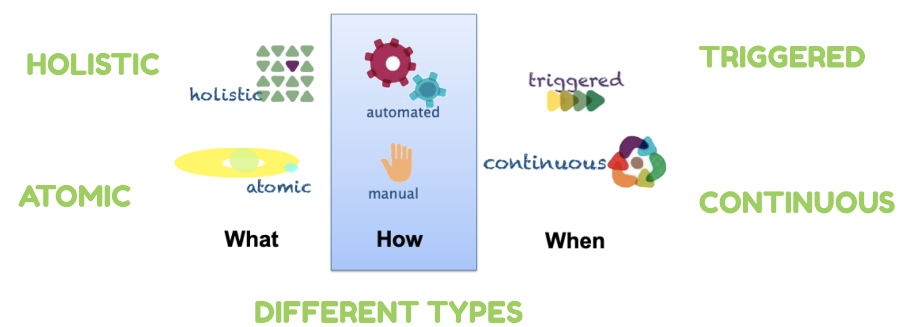
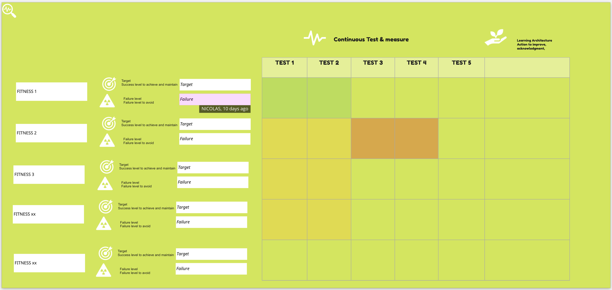

=== Fitness functions or how to protect key characteristics from your product

Continuous Architecture supports guided, incremental change as the first principle across multiple dimensions. Fitness functions can help in finding how well a system meets specified architecture goals and constraints in an automated way in this context.Architects can communicate, validate and preserve architectural characteristics in an automated, continual manner, which is the key to building continuous architecture.

A fitness function is used to summarize how close a given design solution is to achieve its aims. When defining an evolutionary solution, the designer seeks a ‘better’ algorithm; the fitness function defines what ‘better’ means in this context. An architectural fitness function , as defined in http://www.thoughtworks.com/books/building-evolutionary-architectures[Building Evolutionary Architectures], provides an objective integrity assessment of some architectural characteristics you think must be preserved. These characteristics often relate to what we call non functional requirements. 

Fitness functions benefits are numerous but we would like to highlight these ones

* Communicate, validate and preserve architectural characteristics in an automated & continual manner.
* Clarify the product expected architecture performance and the definition of done
* Be reactive to real-time feedbacks on a key characteristics failure
* Get facts to prepare the refactoring plan and the architectural runway
* An architect can request changes to some architecture concern which will then be verified during the build process.
* Integrate devops constraints and ambitions to the architectural works

The below figures illustrates the different type of fitness functions:

* Atomic vs Holistic
** Atomic functions run against a singular context and exercise one particular aspect of the architecture. An excellent example is a unit test that verifies some architectural characteristic, such as modular coupling or cyclomatic complexity.
** Holistic functions run against a shared context and exercise a combination of architectural aspects such as security and scalability.
* Triggered vs Continual
** Triggered functions run based on a particular event, such as a developer executing a unit test, a deployment pipeline running unit tests, or a QA person performing exploratory testing.
** Continual tests don’t run on a schedule, but instead, execute constant verification of architectural aspect such as transaction speed. Monitoring Driven Development (MDD) is a testing technique gaining popularity. Rather than relying solely on tests to verify system results, MDD uses monitors in production to assess both technical and business health. 
* Static vs Dynamic
** Static functions have a fixed result, such as the binary pass or fail of a unit test.
** Dynamic functions rely on a shifting definition based on extra context. For example, a company might build a sliding value for performance based on scalability. 
* Automated vs Manual
** Software architects like things automated. Automated fitness functions execute within an automated context, while manual fitness functions, like legal requirements, defy automation. 
** Manual fitness functions are cases that require the verification of person-based process.

Defining a fitness functions is then a 3 step inquiry process: what do you want to measure? how do you want to measure it? When do you want to measure it? 
The below image illustrates this practice and how to put in place in your team.

image:./img/kit-fitness-functions.jpeg[]

1. Your first activity will be to pick and choose these characteristics depending on the product you're building and its context. In some cases, the response time will be the most important thing you need to deal with. It can also be the scalability of your solution or the compliance of your API to open standards. Or if you want to protect your time to market, following your code complexity can make sense. http://nealford.com/[Neil Ford], one of the inventor of the fitness functions, decided to follow a very specific functions when he's writing his book: the number of Gendered pronoun in his text. As you can see, it can be really linked to your context and what is important to you. Why protecting such characteristics? because if your team does not focus on them, it's likely that over time, because of evolutions, decisions or changes they will be affected. Highlighting them on a regular basis is what this practice is about. A good starting point to define your fitness functions is to review the architectural stakes of your product or the ones given by your organization. From there, you need to select the non functional requirements that can help you to protect those important characteristics to you. 
2. For each and every selected functions, you need to define what to measure and how to measure it (seek for automation here): what is the baseline, your target and the failure threshold. Each fitness function must have an owner in charge of making sure it's measured on a regular basis. 
3. When to measure it is quite simple: can you afford to measure continuously? does that even make sense to do it continuously?

Once, all your fitness functions are defined, you should bring them together on a testing board that should be reviewed every week: for "failing" fitness functions, an action plan must be defined so the team put it back on track. This discipline is key otherwise the reality will be touching you brutally when this characteristic will be failing in production. The whole point of this practice is to avoid this kind of disruption affecting your end users in production.

We do recommend to limit the number of fitness functions your team will follow. 3 is a good number to start with while for mature teams it can be up to 5 or 6. 

