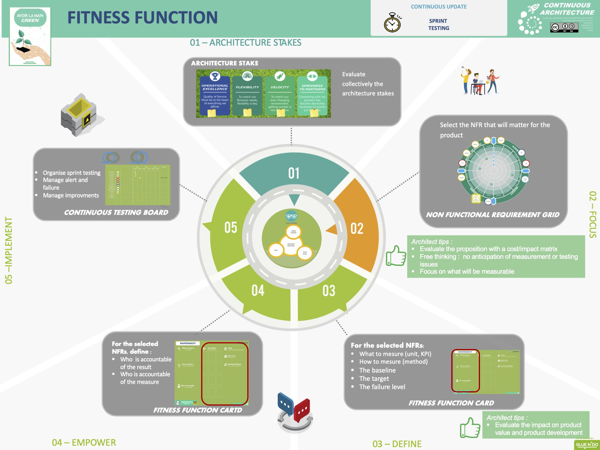

=== Fitness functions or how to protect key characteristics from your product

A fitness function is used to summarize how close a given design solution is to achieve its aims. When defining an evolutionary solution, the designer seeks a ‘better’ algorithm; the fitness function defines what ‘better’ means in this context. An architectural fitness function , as defined in http://www.thoughtworks.com/books/building-evolutionary-architectures[Building Evolutionary Architectures], provides an objective integrity assessment of some architectural characteristics you think must be preserved. These characteristics often relate to what we call non functional requirements. 

Your first activity will be to pick and choose these characteristics depending on the product you're building and its context. In some cases, the response time will be the most important thing you need to deal with. But it can also be the scalability on your solution or the compliance of your API to open standards. Whatever makes sense in your context and that you want to protect over time. Why protecting such characteristics? because if your team does not focus on them, it's likely that over time, because of evolutions, decisions or changes they will be affected. Highlighting them on a regular basis is what this practice is about.

Fitness functions are designed to have objective and quantifiable results. They should be easy to measure otherwise they won't be updated. We believe architects can communicate, validate and preserve architectural characteristics in an automated, continual manner, which is the key to building evolutionary architectures.

A good starting point to define your fitness functions is to review the architectural stakes of your product or the ones given by your organization. From there, you need to select the non functional requirements that can help you to protect those important characteristics to you. For each and every selected NFRs, you need to define what to measure and how to measure it (seek for automation here): what is the baseline, your target and the failure threshold. Each fitness function must have an owner in charge of making sure it's measured on a regular basis. All fitness functions should be bring together on a continuous testing board that must be reviewed every week: for "failing" fitness functions, an action plan must be defined so the team put it back on track. This discipline is key otherwise the reality will be touching you brutally when this characteristic will be failing in production. The whole point of this practice is to avoid this kind of disruption affecting your end users in production.

We do recommend to limit the number of fitness functions to follow. 3 is a good number to start with while for mature teams it can be up to 5 or 6. 

The below image illustrates this practice and how to put in place in your team.

