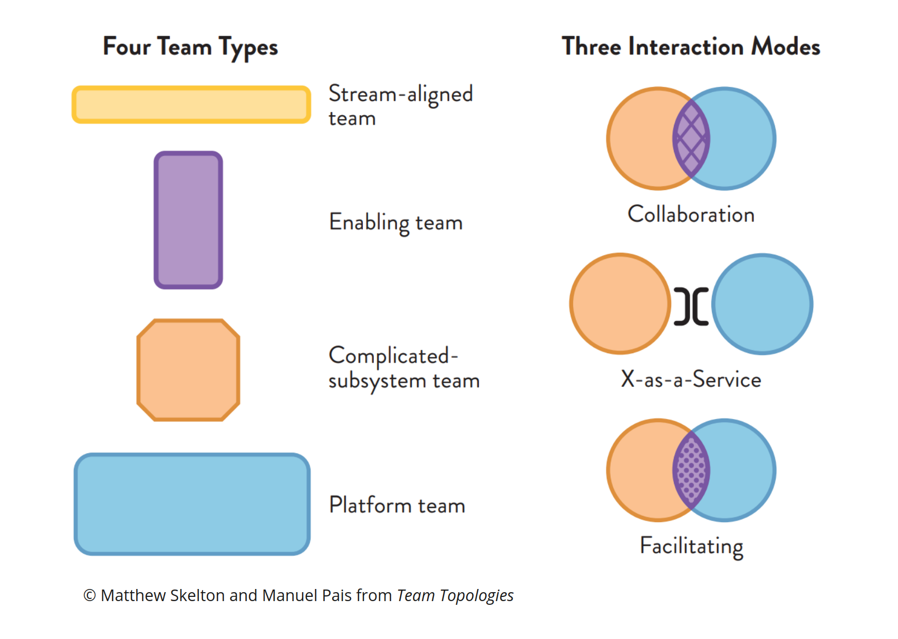
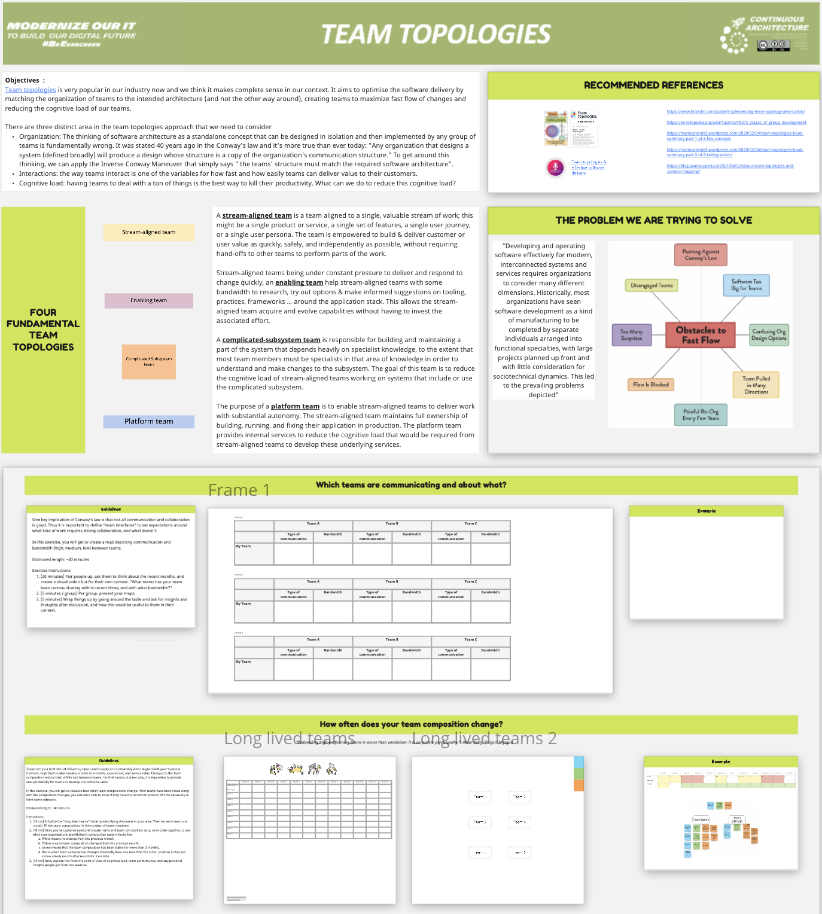

=== Architecting your organization along with your product

https://teamtopologies.com[Team topologies] is very popular in our industry these days and can be summarized in one sentence: how to achieve fast flow of work from development to operations by optimizing teams' organization using four simple team topologies and three interaction modes. 

It teaches us how to shape the organization so that it facilitates and does not get in the way of the intended architecture. Team topologies that mirror a modular product architecture are more likely to enjoy a higher level of autonomy because of reduced inter-team dependencies. The theory behind this phenomenon was formulated nearly 50 years ago by Mel Conway's law which states: "Any organization that designs a system (defined broadly) will produce a design whose structure is a copy of the organization's communication structure."

image:./img/conway-law.png[]

Chances are we've all suffered the consequences of Conway's Law. So why not apply the reverse Conway's maneuver, which recommends that you evolve the organizational structure of your teams to promote the architecture you want. It's a simple but powerful idea.

Team topologies describes four topologies. All the four team topologies are important of course but 2 are pro-eminent from our perspective: Stream aligned teams and platform teams. The first is directly aligned (as its name suggests) with the value stream ^(1)^ of your company and fits well the product approach. While the second promotes the idea that platform teams can help reducing cognitive loads on stream aligned teams by providing them self-service platforms. Providing easy to consume services like a Kubernetes cluster is indeed helping stream aligned teams to focus on the value creation. The interaction modes helps to improve inter-team communication and ways of working. 

Both concepts are designed to reduce teams' cognitive load. Excessive teams' cognitive load is not a new problem. What's new is the approach to analyze and reduce cognitive load. Failing to pay attention to excessive cognitive load negatively impacts teams' efficiency, and therefore their capacity to deliver value. When cognitive load is too high, the backlog of work in program increases which slows down the flow of work.  

==== But how to use it in your context?

Like any new tool, reading the manual is rarely enough to use it effectively. There are plenty of approaches out there and here we propose a “recipe” we've tested successfully. We've built a sequence of workshops to help you go through it and at the end collectively converge on a proposed teams' topology. It's split into 2 main parts: understand the problem we're trying to solve and collaborate on its resolution through team topologies of course

To execute this, a minimum of 1 day is needed to go through all steps. We recommend splitting it in two non-consecutive half days so people can have time to think. As our objective is to align the team organization on the intentional architecture, we strongly advice to do these workshops after the architecture is defined. 

To have an efficient workshop, we suggest involving at least the below roles:

* From existing teams: team leaders, Product Owners/Managers, architects and whoever master enough the value stream
* Enterprise or Business Architect of the domain to get some end-to-end insights
* the managers that are today managing these teams. If you don't it, they will probably react and fight the changes you're pushing. It's better to involve them.

To help you execute this collaborative, we do provide a Miro board available https://github.com/michelin/Continuous-Architecture-Toolkit/tree/master/miro/readme.md[here]

.Typical agenda we use
|===
| Step | Details 

|Which teams are communicating and about what? 
|Help attendees to formalize their ecosystem, which teams they are currently working with and how do they collaborate.

|How often does your team composition change?
|Teams that have stable staffing over years are extremely effective. On the other hand, teams often changing composition face delivery issues if not members' departures. This exercise is to highlight potential issues there.

|Map Topology and Interaction for Your team/context
|Before finding a better organization matching the desired architecture, the objective here is to capture the organization as it’s today and the different relationships between teams.  Probably, for a domain where Team Topologies has never been used / deployed, attendees will struggle to map the existing teams on the 4 topologies. That's perfectly normal as we want them to self-realize there could a problem.

|Delivery symptoms
|Now it's right time to help attendees to reflect on the delivery problems they may have. This will be helpful to identify solutions especially those related to team organization (size of teams, dependencies between teams …)

|Map Topology and Interaction for Your team/context
|It's the key part of the workshop as it's when attendees try to re-define teams, map them on the 4 topologies and define how these new teams will interact together. We recommend either splitting the workgroup in sub-groups (if possible) or outlining alternatives. You will then be in a position to compare them, find the best one or create new scenario mixing several alternatives (an hybrid approach in a sense).

|Staff Your Teams
|Once all alternatives are outlined, we need to evaluate if they are feasible. And when it comes to team organization, being able to staff teams with the appropriate skills is critical. For this we use the skill matrix, a tool from our Lean & Agile coaches.

|Team API
|last step of the workshop, we try to summarize everything we've done in the definition of Team API that could be used as the team identity card.
|===

^(1)^ Value Streams represent the series of steps that an organization uses to implement Solutions that provide a continuous flow of value to a customer. Each value stream is a long-lived series of steps used to create value. A trigger starts the flow of value, and there’s some form of monetization or value delivered at the end. The steps in the middle are the activities used to develop or deliver the value.