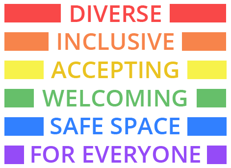
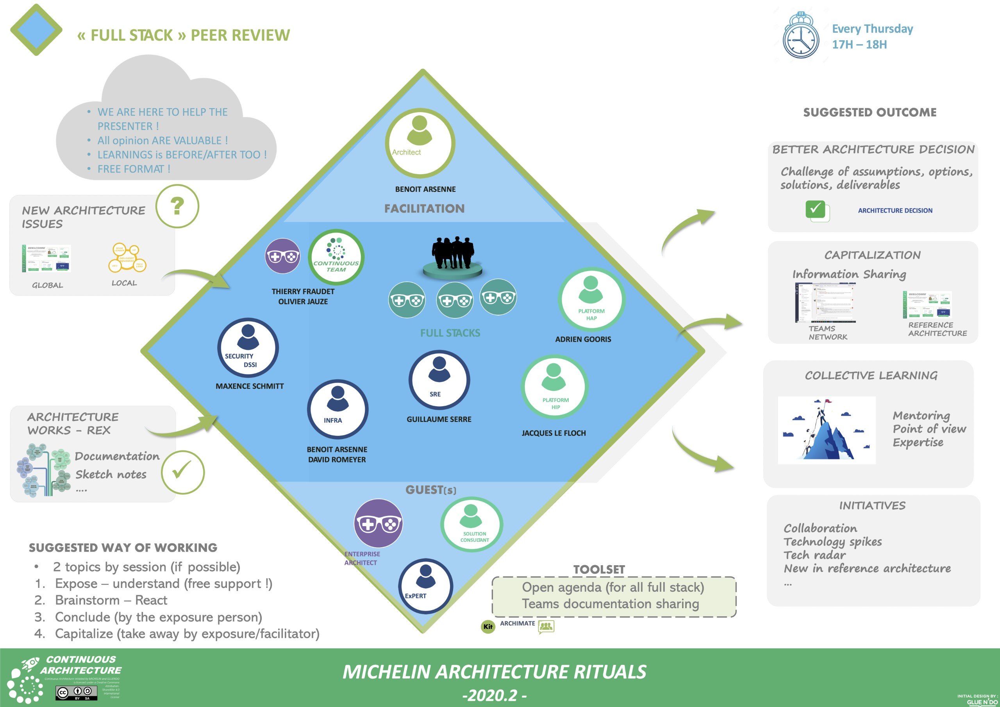

=== Architecture peer review
=== Architecture peer review or how to help your community to grow

Too often in the past, there was this notion of board or review with the idea of validating an architecture. Per our manifesto, we don't prove an architecture with a review of documents, we prove it by implementing it. So let's stick to this and change the approach for reviews. 

The main change we propose is to leverage the architecture community to improve your architecture. The beauty of our job is that there is no one size fits all solution and the problem you're trying to solve (ie user or customer pains) can not always be addressed with the same recipe.

This ritual, proposed on a weekly basis, is an opportunity for a team or an architect to share a design or submit a problem to his peers. It's a way to get a feedback in a safe environment. And this point is extremely important: people will never express their doubts or the fact that they haven't found a solution if they are not in a safe environment where no judgments or criticisms are made. To make this explicit (in a domain driven design spirit), we suggest that you display in the introduction of the session what you think is important to have a safe environment. Something like this.

Getting feedback on your design is one possible outcome of this review but you can also get ideas or new designs. And that's where it's becoming interesting: when you're working in a given domain, over time you start to always apply the same answers. When you have a hammer in your hand every thing looks like a nail right? Leveraging the power of the community is also a way for you to get unexpected solutions.

We suggest a simple way to animate this session:

* Prepare the session ahead of time by asking the community if there are some topics to work on. There is a risk that every one being busy on their day to day activities, if you don't to dit you'll have no topics.
* Work on maximum 2 topics per session
* Ask the presenter to share his topic 
* Brainstorm on the design 
* Let the presenter recaps what he understood and discovered
* The facilitator can end the review with some key take away he captured along the session 

The below picture summarizes this ritual.

