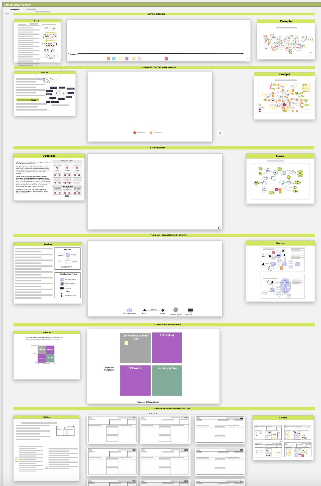
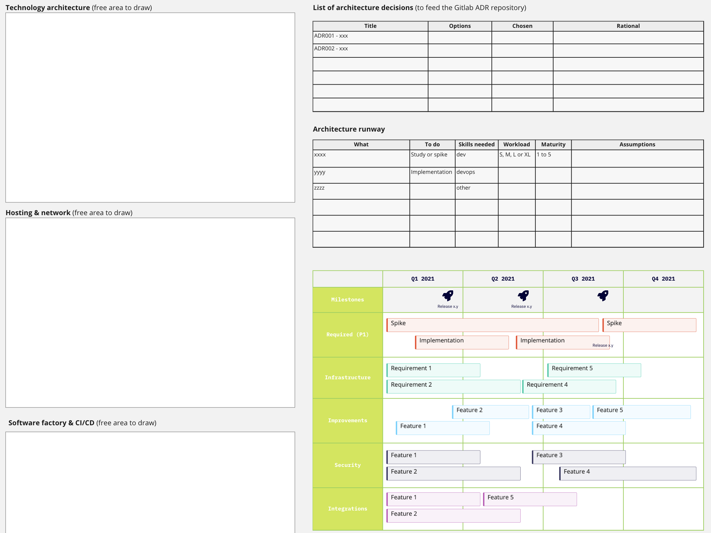

=== Scoping 360 architecture workshop

This architecture workshop belongs to the xref:scoping360.adoc[Scoping 360° approach] that we proposed when we create a product. To outline the architecture of a product, we have defined a sequence to help you cover all aspects of the architecture in a 360° overview manner. The objective is to collectively and progressively define the architecture of your products but also to produce the minimal set of architecture deliverables. Because yes we do believe architecture documents have to be produced.

Two important messages here:

* This ritual should not only be used at the beginning of your product lifecycle but for each main iteration or Minimal Viable Product. And you can adapt the sequence depending on your need. It's quite obvious you'll spend more time up front than for sub-sequent MVPs.
* It's crucial to focus your discussion on the next product increment (ie MVP). Do not try to answers all questions to produce the ultimate architecture target.

image:./img/scoping-architecture.jpg[]

==== How have we constructed our sequence? 

* It usually starts with an event storming workshop to discover (or re-discover) your domain and identified bounded contexts. It also "forces" us to think of our system with real business events and not to describe it with messages exchanged by software applications.
* Defining bounded contexts can be very useful to both ensure modularity in your system but also adapt & optimize the organization that will deliver it.
* Then we describe each context and how they related to each other with the famous strategic integration patterns
* To not loose the sight of the end to end ecosystem, connecting contexts fulfilling end-to-end business use-cases is useful. It also helps to make sure you  decomposition is coherent.
* Before moving to the description of each contexts, it is interesting to reflect on how you'll deliver each context. How will you implement a context that is core to your business or helps you to differentiate? Should you develop the context or simply buy an existing solution? 
* Once this design (and its decomposition) is done then we can move to the technology stack you need and how are you going to deploy & operate it. One finds there Continuous Integration & Delivery (CI/CD), monitoring and observability etc
* all along the way, recording your architecture decisions is essential 

The below images are extracted from a https://miro.com/[Miro] board we created. Miro is a collaboration tool that helps creating content online and that fits well this kind of workshop. You'll recognize the sequence we just described.

