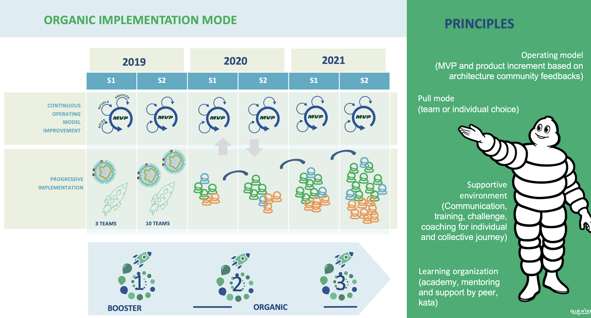
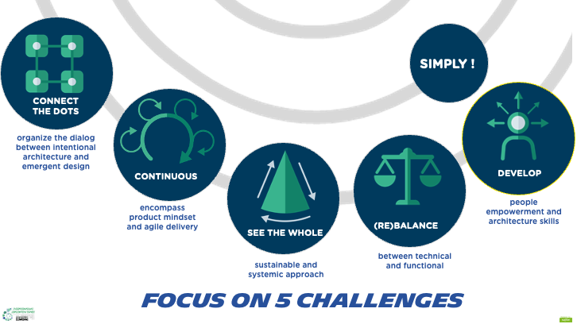

[[start-your-journey]]
=== Start your journey

The deployment of the new ways of working (practices, rituals, framework) described in the Continuous Architecture Framework and Toolbox is a major change journey. There is no single pathway to move your enterprise (or part of it) from its current state to the ideal state (or north star) we recommend and which is embodied in the key tenets of the link:/docs/manifest/manifesto.html[Continuous Architecture Manifesto].

There are multiple ways of starting your journey:

* Bottom-up: deploy Continuous Architecture on a limited scope with a magnitude of change compatible with your existing organization's culture.
* Top-down: design and deploy a more ambitious change journey which scope will be a subset of your enterprise, for example one of its _Operating Unit_. Then extend it to cover more and more Operating Units.
* Organic: it's a mix of Bottom-up and Top-down. 

The bottom-up approach can help you _"test the water"_ and demonstrated success. At some point when your organization will be ready for a more ambitious change agenda you will likely need to shift to a combination of bottom-up and top-down approach.

The diagram below which is described in the _"Organization"_ view of the link:/docs/framework/framework.html[Continuous Architecture Framework], can help you define the scope and pace of your change journey. 

++++
<object type="image/svg+xml" data="img/organization.svg">Your browser does not support SVGs</object>
++++

==== Start your Bottom-up journey

The bottom-up approach is mostly at the team level and scopes one or few agile teams. First you will start assessing teams'  autonomy as each team as a uniq combination of people & skills and a different master degree on architecture activities. The link:/docs/rituals/team-autonomy-readiness.html[team autonomy readiness tool] was designed for this purposed. 

Then, we recommend to experiment a few CA practices without changing the way teams are structured. For example documenting your architecture decisions using the link:/docs/practices/architecture-decision-records.html[Architecture Decision Record] template is usually a good place to start. It's an easy tool to use with a huge pay off as it makes explicit and sharable the decisions we make. Then, starting to describe your architecture journey in the link:/docs/practices/architecture-runway.html[Architectural Runway] will make it explicit to the team but not only. Rituals like the link:/docs/rituals/weekly-architecture-meeting.html[weekly architecture meeting] are designed to create opportunities to collaborate in the team on the architecture. They form the dialog zone we promote.

If your teams are structured along projects or functional skills you might discover they are not cross-functional and they are slowed-down by too many dependencies. At that point you might want to revisit the existing teams' topologies and shift them from a project structure and mindset to a product one as described in the link:/docs/framework/organization.html[Organization] section.

When shifting to a truly agile organization, you might discover your teams are missing key skills, for example product owners or agile practitioners ones. To close we recommend investing first in re-skilling existing teams members and possibly hiring new talents.

During this transitions you might discover the existing reward system of your enterprise gets in the way of agile ways of working. For example teams may be get rewarded when the deliver outputs and not when customers experience outcomes. At this stage a bottom-up approach may reach its limit. For example you might have to talk to management and HR to move the needle and evolve the existing reward system. It is time to initiate a more ambitious change journey.

[top-down-journey]
==== Start your top-down journey

//Continuous architecture was not designed to be deployed using a top down approach.
//Nevertheless, a Classical top-down can be chosen and with some limits (to-be developed)

//You may also consider deploying a management framework, for example link:https://www.kotterinc.com/8-steps-process-for-leading-change/[Kotter's 8-Step Process for Leading Change]. Since in a VUCA world classical top-down change management has limits and each enterprise is likely to conduct a change management journey that meets it specific needs describing a change management framework is out of the scope of Continuous Architecture.

//pending Frederic

Scaling agility beyond a few teams is challenging because of the scope and magnitude of changes the enterprise needs to make. For example, enterprises not only must transform their operating model but also change their culture which is challenging. 

Let's illustrate this with the example of three large banks that adopted an agile operating model inspired by Spotify footnote:[See experience report from Société Générale and Fidelity] footnote:[see ING's agile transformation article: https://www.mckinsey.com/industries/financial-services/our-insights/ings-agile-transformation]. It defines two categories of teams:

* _Stream-aligned teams_ footnote:[See: https://teamtopologies.com/book], designated as _Squads_ and _Tribes_ in the Spotify model
* Teams that develop expertise and knowledge across stream-aligned teams, designated as _Chapters_ and _Guilds_ in the Spotify model

In the Fidelity and ING examples, the new organizational model was implemented in a top-down manner. Employees had to re-apply for new positions defined using the Spotify model... 

Adopting a new organizational model is not sufficient. Other aspects of the operating model must change:

* On the management side, objectives and reward systems must be revisited
* On the people side, re-skilling and up-skilling must be planned and executed
* On the cultural side, the leadership model, the ways of working, the beliefs, mindset and behaviors must evolve

For example: 

* At Société Générale, _aligned autonomy_ was facilitated by a shared purpose and a set of cascading Objectives and Key Results (OKRs)
* At Fidelity, a set of leadership principles such as _"tells it like it is and enables candid debate"_, _"empower others to make decisions"_ or _"owns the outcome"_ helped modify the culture 

When steering a change journey that has so many moving parts, it may be tempting to use a comprehensive change management approach. Describing a general purpose change management framework is beyond the scope of Continuous Architecture. For the reader who is looking for one, Kotter's 8-Step Process for Leading Change footnote:[See: https://www.kotterinc.com/8-steps-process-for-leading-change/] is a place to start.

A word of advise, it is risky to focus on frameworks that are in the solution space before making sure your enterprise is tackling the right problems. It applies to both _Agile @Scale_ frameworks such as SAFe or Spotify and change management frameworks.

By mimicking the Spotify model (i.e. Tribes, Squads, Chapters, ...), enterprises are at risk of neglecting two key ingredients footnote:[See: https://www.infoq.com/news/2016/10/no-spotify-model/ or https://www.business2community.com/strategy/there-is-no-spotify-model-for-scaling-agile-02284278]:

* A culture of experimentation to help the emergence of an agile @scale model that meets the specific needs and of the enterprise
* The cultural dimension that is a pre-requisite to successfully implementing a new agile @scale operating model.

Continuous Architecture was not designed to be deployed alongside the top-down deployment of agile @scale or change management frameworks. Instead, we advocate an organic approach that starts from the specific problems and circumstances of the enterprise, mixes bottom-up with top-down and promotes continuous experimentation and learning.

[organic-journey]
==== Start your organic journey

An organic approach is about creating an environment for a situation potential. It can start with a bottom-up first step to demonstrate the benefits on a small environment carefully selected. We could think good performing teams are a place of choice to start with but we would recommend to pick teams that have some difficulties like long time to make decisions or high level of technical debts. These kind of teams will be willing to listen to you and try new things to make some progresses. In this phase, you can use ADRs, the runway and put in place all the rituals we have. The idea is to use whatever helps the teams. 

Once your demonstrators are producing their first results, you can then seek for support from your organization. It will help kicking off the second phase of your plan with a top down approach but not a classical one which aims to cover an Operating Unit from top to bottom. Instead of choosing a given Operating Unit, we'll try to address several domains at the same time. But Organic means we recognize that each domain can progress as its own pace because they can have different constraints. It promotes adaptation as your domain may have specific needs or rules you have to deal with.

In a sense, the organic approach is a mix of bottom-up and top-down. 

[michelin-organic-change]
===== Organic change approach: Michelin's example

Three years ago, Michelin diagnosed that architecture could become an unbearable bottleneck and would not be able to sustain the digital acceleration. It was necessary to consider a structural change to better support the delivery team in their attempt to deliver value; at the same time, develop an operating model to maintain integrity at scale with empowered people, notably the architect community. The Continuous Architecture initiative was born: Michelin and Glue N'DO joined their forces to design and roll out an operating model to address Michelin architecture's main challenges. 

Let's describe the journey and its main achievements:

* In the last 3 years: from boosters initiatives to global organic deployment 
* The 5 Michelin's initial challenges 
* The enablers: a shared vision, a guiding team, an open toolbox, an evolutionary model, a community and a network 
-> Organic change is about: "Thinking big and acting small" 

Michelin's Continuous Architecture journey is a transformational one. From the beginning, the aim was not only to put new architectural approaches and roles in place but to develop a new architectural collaborative model, able to support the digital transformation. The change was progressive, step-by-step but without a predefined road map and at a rate of change at the hand of stakeholders. 

This journey has two phases: the rising phase and the organic roll-out phase.

====== Transformation journey's phases

*Rising phase* 
 
We started with couple of volunteer teams in which we staffed architects and deployed some of our practices & rituals. There were two objectives for us:

1. tests our first MVP for the Continuous Architecture product and gets some feedback.
2. Demonstrates Continuous Architecture was helpful for teams. 

This first step was important because it was a way to prove a shift was possible. It gave credibility and enabled the organization to identify the structural barriers to be removed and to avoid the temptation of former habits of architecture control-mode.

We stayed in that mode for a year or so to get enough feedback and share with our organization the first results. These first adopters helped up to consolidate these practices in our operating model so that the teams making the choice to launch the journey, would have the toolbox and the supportive environment to be able to succeed.
 
At this point, the feedback was positive enough to start asking the question: shouldn't we deploy it more broadly and quickly? 
The rising phase was important because it was a way to prove that a shift makes sense: it was relevant to simplify the architecture roles, concentrate on architecture decisions and change the architecture's collaborative model in a more conversational and teams-mode. The rising phase gave credibility and enabled the organization to identify the structural barriers to be removed, to avoid the temptation of former habits of architecture control-mode.

*Organic roll-out* 

While the answer to the above question was globally yes, there were lots of debates on the how. We ended up with the Organic roll out approach: our chief Enterprise Architect was supportive of the initiative and asked all the different domains in Europe to deploy the Continuous Architecture operating model. But he also recognized that each domain were different in size, complexity, staffing ... Following the empowerment approach being deployed at Michelin, he asked each domain to come with a plan and defined themselves their objective for the year. 

So despite the Covid pandemic, the years 2020 & 2021 were the years to implement the new model organically. As we were convinced that the behaviors and practices would depend upon the capability of individuals to adopt new believes, and on the organization to adopt a new culture, the choice was to empower the architect community as an agent of change (to be honest, it was because of the frugality of the change resources too).

On-boarding sessions were set up to start individual and architecture team journeys. It was like ‘day-offs’ from the operational work, a time to share within all participants each of their individual architecture beliefs and a moment to have a step back about its architecture context, challenges and environment. The common aim of all sessions was to share the model and the cultural shift, but also to identify which new collaborative practices to put into place in accordance to each context. The architects' duos (Full Stack and Product) were empowered as change leaders. Based on their own believes and leadership skills, they would redesign the local model and develop awareness so that stakeholders would be able to implement the “just enough” practices in their playground scope.

We put in place a simple tracking system to help them follow their progresses. 

We are still in the organic mode and we progressively extend our perimeter: other geographic zones, infrastructure teams, digital teams ... As of mid 2021, we have covered two zones and 60 architects making our Organic approach successful. But we can also recognize it has some limits especially in how we help our organization to adopt the product approach which is something by design not limited to the IT structure.

====== Michelin's 5 initial challenges

Each company has its own Architecture's challenges due to its business ecosystem, historical organization, contract model or technological choices. At Michelin we first concentrated on 5 progress areas as depicted below. We do acknowledge that these progress areas are tightly linked to our context and may not fit yours. Thus, Continuous Architecture is not a "to be" model to implement.

The 5 initial challenges Michelin decided to tackle first and on which we tried to focus are presented in the figure below.

Identifying these 5 core challenges was a way to facilitate the choice of practices, roles, rituals accordingly and to act as a "call for action" towards the stakeholders, even though they made the final choice 

One of the first issue we tried to deal with was the distance between team members and architects. Architecture was way too often a top down approach in the past: architects were pushing their designs to delivery teams and then moving on the next project. We needed to revisit this approach and adopt a "meet into the middle" one. We called it **connect the dots**. This meet in the middle is the balance between the intentional architecture and the emergent design. That zone is called the dialog zone and it must be opened enough to meet the challenge through a conversational model. 

Even if we deployed Lean & Agile practices couple of years ago, our organization was still driven by projects and we wanted to tightly couple our Continuous Architecture initiative with the product mode. In addition, there is a big change to deal with in the VUCA world: software engineering became continuous from exploration to identify the problem to fix, building to develop the product value, to deployment where we operate the product and harvest the value. Naming this progress area **continuous** helped us to link it with other software engineering practices like Continuous Integration or Continuous Delivery.  

Behind the **see the whole** is hidden two distinct elements

* organization wise, a product was "owned" by two different teams (build & run) each producing architecture designs and thus document. We wanting to close this gap by merging these designs and documents into a single unit really owned by the product team. That led us to use the fullstack terminology to explain that a product has to be designed from top to bottom.
* a product is quite rarely integrated with no other products, we wanted to reminder that a product has to be designed with the system it is integrated with. And here we used strategic integration patterns from Domain Driven Design for instance.

**Re(Balance)** is all about making space in product backlog to "non functional" items. Too often in the past the priority was given to "business" features leading to not taking enough into account what is important architecturally wise like expected performance, quality of services, upgrading technical components ... It led to a significant deterioration of the quality of service of our products. We needed to re-balance this and we used for that the Architecture Runway.

Last but not least: **people**. Changing the architecture operating model is all about the people. So here we took care of defining our architects roles and their required skills. And to help bridge the gap (if any), we put in place an architecture academy with identified trainings but also a coaching proposal and collaborative intelligence tools like link:/doc/rituals/architecture-kata.html[Architecture Katas].

===== The enablers

Having a new operating model is essential but not enough. We needed some enablers to make the change happen. By enabler we mean: a shared vision, a guiding team, an open toolbox, a scalable model and a community.
 
====== A shared vision and a guiding team coalition

At the beginning, even though the Michelin's feature teams were working in an agile mode, it become obvious that the architecture activities were not fully adapted to an agile world. In a VUCA context, the near future is not predictable, then the Information System needs to be developed in a way that it can evolve whatever the new scenario looks like. Let’s develop our products in the most decoupled way as possible became an obsession for us. We had to redefine our reference architecture patterns to promote not only monoliths, but cloud native, event driven and micro-services solutions built using technical platforms. 

Architectural patterns & new technologies are key to give flexibility to the IT system and become a data-driven company. But a pure "tech" push was not going to work. A group of people, mainly architects, were convinced that yesterday's architecture methodologies and processes will not deliver future solutions. As many other companies, Michelin is coming from a world where architecture decisions were taken centrally and, with the increasing need of speed and continuous delivery, architecture would have become an unbearable bottleneck. But decentralization is more complex than simply delegating authority. In other words, it was time to develop alignment and autonomy over control and to rebuild the architecture collaborative model while making sure we could maintain our system integrity at scale and making people autonomous and safe when they take initiative. 
  
Sharing the need of rapid change and building a guiding coalition based on some advanced successful experience was crucial in the journey. The consolidation phase leads to seven core beliefs that are highlighted in the Continuous Architecture Manifesto.
  
====== An open toolbox 
  
The Continuous Architecture's toolbox is a set of practical tools, practices and rituals for architects. But we had a fundamental believe: each team is different and need to adopt the toolbox in its context. At Glue N'DO, we are crazy of darts. For the Continuous Architecture Toolbox, we suggested to Michelin teams an architecture's dart game: the teams would have to identify the practices adapted to their context and select the one to be positioned in the bull's eye. A good architect servant leader develops the team skills in order to put the chosen dart in the Bull's eye. 
  
====== A scalable collaborative model 

Michelin's teams may not have the same architecture maturity due to turnover, discovering of technologies, business and IT knowledge or staffing issues. Their products may not have the same architecture challenges depending on their impacts, maturity stages from innovation or scaling to even decommissioning perspectives. In Continuous Architecture, we provide an autonomy assessment kit. 
  
The goal is to define locally the good collaborative model based on a shared assessment between architects, former 'decision makers' (the management)  and 'doers' (the squads) about the situation and coming challenges on 2 axes : team maturity vs product architecture challenge. 
  
The stakeholders will define the cutting edge organization, the way architects will support the team and lead some topics by themselves. The former governance barriers would be removed or maintained depending on whether the conditions (architecture’s risks and team’s capabilities) are met or not. 

It appears key to define and monitor an evolutive collaborative model so that integrity can be maintained, avoiding bureaucratic slowdown. 

====== A community and network 

With the internal and open-source Continuous Architecture communities, Michelin aims to build a supportive environment to be part of or guide the architecture’s core stakeholders. At Michelin, the Continuous Architecture community of Practices is organized monthly at both local and global level. Thanks to the open source initiative, it will be a way of joining our forces, building a step ahead model, avoiding pitfalls and accelerating the change. 
  
====== An Organic change approach : "Think big and act small" 

Launching a Continuous Architecture journey is changing the way architecture's decisions are taken in order to develop alignment and autonomy at different levels in the organization. It is a kind of 'big opportunity' which requires a leading change that, not only re-engineer the processes and methodologies, but also transform the underlying mindset, culture and learning model. 

Top-down change management demonstrated its inadequacy. At best, it brings an illusion of change. It does not favor empowerment of people and a sense of discernment, which are required to spread out a Continuous Architecture operating model. We expect digital stakeholders and architects to play a role in the new model and to act as leaders of change, participating actively in the architecture's learning organization.

Bottom-up change management may quickly reach a glass ceiling effect as the environment would not be prepared for it. As a consequence, a lot of energy may be wasted to deal with constraints. Bottom-up is not an option neither. 

As an independent experienced professional in enterprise architecture, my recommendation is an Organic approach as we did in Michelin. You could be inspired by Kotter's methodology, to well conduct the Continuous Architecture journey. My advice: Think big and Act small! 

By thinking big, I mean communicate on a vision while building up a supportive and favorable environment, daring to remove the structural barriers. By acting small, the idea is to take the time to empower local teams so that the teams will implement what makes sense for them taking into account their context, defining the acceptable speed of change while identifying synergic opportunities and being innovative. 
