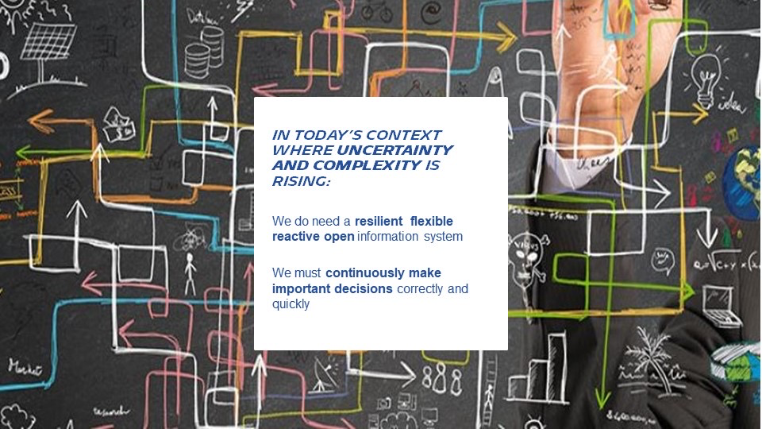
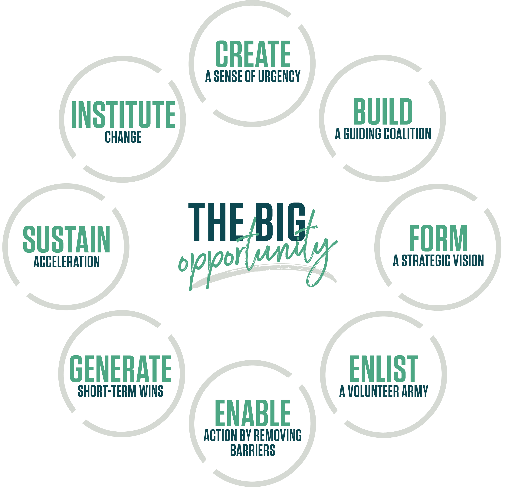

[[start-your-journey]]
=== Start your journey

The deployment of the new ways of working (practices, rituals, framework) described in the Continuous Architecture Framework and Toolbox is a major change journey. There is no single pathway to move your enterprise (or part of it) from its current state to the _"to-be"_ state we recommend and which is embodied in the key tenets of the link:/docs/manifest/manifesto.html[Continuous Architecture Manifesto].

There are two ways of starting your journey:

* Bottom-up: deploy Continuous Architecture on a limited scope with a magnitude of change compatible with your existing organization's culture
* Top-down: design and deploy a more ambitious change journey which scope will a subset of your enterprise, for example one of its _Operating Unit_.

The bottom-up approach can help you _"test the water"_ and demonstrated success. At some point when your organization will ready for a more ambitious change agenda you will likely need to shift to a combination of bottom-up and top-down approach.

The diagram below which is described in the _Organization"_ view of the link:/docs/framework/framework.html[Continuous Architecture Framework], can help you define the scope and pace of your change journey. 

++++
<object type="image/svg+xml" data="img/organization.svg">Your browser does not support SVGs</object>
++++

==== Start journey Bottom-up 

The bottom-up approach is mostly at the team level and scopes one or a few agile teams. First you will start experimenting a few CA practices and rituals without changing the way teams are structured, for example documenting your architecture decisions using the Architecture Decision Records (ADRs) template or assessing teams' autonomy. 

If your teams are structured along projects or functional skills you might discover they are not cross-functional and they are slowed-down by too many dependencies. At that point you might want to revisit the existing teams' topology and shift from them from a project structure and mindset to a product one as described in link:/docs/framework/organization.html[Organization].

When shifting to a truly agile organization, you might discover your teams are missing key skills, for example product owners or agile coach ones. To close we recommend investing first in re-skilling existing teams members and possibly hiring new talents.

During this transitions you might discover the existing reward system of your enterprise gets in the way of agile ways of working. For example teams may be get rewarded when the deliver outputs and not when customers experience outcomes. At that stage you might have to talk to management and HR to move the needle and evolve the existing reward system.

Last but not the least, we recommend you put in place some impact tracking system to document the benefits of these local changes. At that stage you might be ready to add a top-down component to your change agenda.

==== Start your journey top-down

// == Proposition Nicolas

Act now and Think big !
 
Launching a CONTINUOUS ARCHITECTURE journey is changing the way architecture's decision are taken to develop Alignement and Autonomy at the different level of your organization.
 
It is a kind of "big opportunity" requiring leading change to not only reingeniering the processes and methodologies, but also the sub-jacent mindset and culture.
 
Since four decades, Dr. Kotter’s observes countless leaders and organizations trying to transform or execute their strategies. He identified and extracted the success factors and combined them into a methodology : https://www.kotterinc.com/8-steps-process-for-leading-change/[8- Step process for Leading Change]

As an independent experienced professional and consultant for change, I do recommend Kotter's approach as an inspiration to conduct a CONTINUOUS ARCHITECTURE journey.
MICHELIN's CONTINUOUS ARCHITECTURE roll-out is an example towards what we call a transformational journey which has the aim not only to put in place new architecture's approaches and roles but to develop a new collaborative architecture model to sustain the digital transformation.
 
Nota : We reference Kotter's recent books on "accelerate" and recent "change" for additional insights on his classic principle 'people and culture first'.

== CREATE A SENSE OF URGENCY

____
"Help others see the need for change through a bold and aspirational opportunity statement which communicates the importance of acting immediately". Kotterinc.com
____
 
VUCA world is about growing (Growing Volatility, Growing Uncertainainity, Growing Complexity, Growing Ambiguity) and, in the same time, digital is 'eating' the world.
 
If the people in your organisation is not yet fully aware of the transformational change and the massive breakthroughs required to manage the knife-edge between sustanibility and innovation, you should ask yourself what kind of initiatives could be taken to create this sense of urgency.
 
Is your organisation ready to detect and react the future technological or social breaktroughs? Do you have digital capabilities and IT architecture in place to  tu  innovate , rescale your product or shift your business model? Are your teams more in a detect/ respond mode of action, rather than a command/ control mode? Do you have a best-in-class learning organisation?
 
You, advanced digital leaders and architects, develop awareness and provide tangible facts to your organisation about its potential to face the VUCA world.

== BUILD A GUIDING COALITION

____
"A volunteer army needs a coalition of effective people – born of its own ranks – to guide it, coordinate it and communicate its activities". Kotterinc.com
____

Cultural change and new operating models require a core opened and, if possible, a multidisciplinary team. Detect and mobilize a group of "constructive and engaged people" will become the next challenge on your journey.
 
Why changing the way we 'architect' our solutions?

In a VUCA context, we cannot predict what the near future will be so let's design our Information System in a way it can evolve whatever the new scenario looks like.
 
Despite important, giving flexibility to the IT system is not enough. In our opinion, yesterday’s architecture methodologies and processes will not deliver future solutions as organizations will become be too slow, where its architecture becomes the bottleneck, with teams that lack autonomy and alignment.
 
If you share this starting point, it will become quickly obvious that rebuilding your company's collaborative model with the double objective of maintaining system integrity at scale and making people autonomous and safe when they exercise initiative, is crutially urgent.

Agile Framework like SAFe provides guidelines and methodologies to organise the delivery and operation of product. With CONTINUOUS ARCHITECTURE we have a complimentary approach where the focus is on dialogue and decision with a gut feeling that people and a new collaborative model are the change makers.
 
You, advanced digital leaders and architects,  on-board engaged people ready for a new collaborative model.

image:./img/yestereday.png[]

== FORM A STRATEGIC VISION

____
"Clarify how the future will be different from the past and how you can make that future a reality through initiatives linked directly to the vision." Kotterinc.com
____

The vision is dependent on your context. According to Ken Wilber's model, the vision should be both individual and collective, within an internal and external dimension. Consequently, several main things need to be defined, requiring a strong communication plan: your beliefs, mindset and your focus area of progress.
 
To support the CONTINUOUS ARCHITECTURE initiative, we proposed a Manifesto to underline the shift in term of architecture mindset. 
  
The CONTINUOUS ARCHITECTURE's Manifesto

There are famous manifestoes out there such as the Agile Manifesto, the Reactive manifesto [Reactive one] etc with which the CONTINUOUS ARCHITECTURE Manifesto does not even try to compete. Our intention is to list our beliefs around our architecture operating model. To move from a former waterfall approach - where architecture is done mainly before features are implemented, into a continuous runway, as architects, we need to adopt a new mindset embodied in the seven believes below:

image:./img/manifesto.jpg[]

== The CONTINUOUS ARCHITECTURE's Challenge (MICHELIN's journey 2019/20)

Improving architecture by accelerating the decision-making dynamic is a constant and global preoccupation. But where and how to start? Identifying the core challenges with a common direction and illustrating what could be done in terms of roles, practices and rituals may help the teams to orient their innovative energy and get quick-wins. 

With Michelin's Architecture stakeholders, at first we concentrate on five area of progress:
 
image:./img/challenges.png[]

You, advanced digital leaders and architects, assess the way you are 'architecting' in order to clarify where you can bring value and identify the primary challenges.
 
== ENLIST A VOLUNTEER ARMY

"Large-scale change can only occur when massive numbers of people rally around a common opportunity. They must be bought-in and urgent to drive change – moving in the same direction". Kotterinc.com

Architecture teams are, by their nature, sensitive to dialogue, able to thinking and acting in a systemic logic, anticipating the growing complexity. It is the volunteer army's fishpond to support a digital journey.
 
Nevertheless, the difficulty is in the execution. CONTINUOUS ARCHITECTURE's toolbox is a practical accelerator material for the "army" to pick up the relevant practices.
 
At GlueN'DO, we are found of darts. With our CONTINUOUS ARCHITECTURE Toolbox we propose an architecture's dart game. The teams identify the practices adapted to their context and select the one to be positioned in the bull's eye.

image:./img/kit-generic-progress-plan.png[]

A good architect leader develops the team skills to put the chosen dart in the Bull's eye.
 
You, advanced digital leaders and architects, enroll people in your organisation giving them awareness, autonomy and the CONTINUOUS ARCHITECTURE toolbox, so they are able to lead the change and develop outstanding skills where it really matters.
 
== ENABLE ACTION BY REMOVING BARRIERS

____
"Removing barriers such as inefficient processes and hierarchies provides the freedom necessary to work across silos and generate real impact". Kotterinc.com
____

Providing safe environement to take decisions and true autonomy are key aspects.
 
With CONTINUOUS ARCHITECTURE, we provide an autonomy assesment kit so that the collaborative model can be adapted to the shared assessment between former 'decision makers' (the management)  and the 'doers' (the squads).
Thanks to that, former governance barriers could be removed, if the conditions (risks and teams capabilities) are met.

You, digital leaders and architects, define and monitor an evolutive collaborative model so that integrity can be maintained, avoiding bureaucratics slowdow.

== SUSTAIN ACCELERATION

____
"Press harder after the first successes. Your increasing credibility can improve systems, structures and policies. Be relentless with initiating change after change until the vision is a reality". Kotterinc.com
____

Acceleration requires the organisation to become a truly architecture-learning place.
 
That's why, for instance, at Michelin, GlueN'DO is building an academy with trainings on:

* Architecture skills
* Technical knowledge and expertise
* Business knowledge and expertise
* Leadership and soft skills
 
== INSTITUTE CHANGE

____
"Articulate the connections between the new behaviors and organizational success, making sure they continue until they become strong enough to replace old habits". Kotterinc.com
____
 
With the open-source CONTINUOUS ARCHITECTURE community, we aim to build a supportive environement to be part of or guide your own team. Joining our force would be a good way to build a step ahead model, avoiding pitfalls and accelerate the change.
 
Join us ;)
