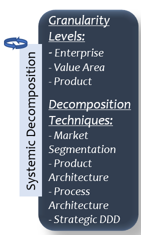

= Systemic decomposition
// Metadata:
:description: Practice
:keywords: guide
:main-title: Continuous Architecture Toolkit 
// Settings:
:icons: font
:idprefix:
:idseparator: -
:preface-title: 
:toc:
:toc2:
:toclevels: 3
:numbered:
:sectlinks:
:sectanchors:
:experimental:
:stylesdir: ./css
:scriptsdir: ./js
// GitHub admonitions:
ifdef::env-github[]
:tip-caption: :bulb:
:note-caption: pass:[&#8505;]
:important-caption: :heavy_exclamation_mark:
:caution-caption: :fire:
:warning-caption: :warning:
endif::[]

// tag::all[]
:imagesdir: img
:section: practices
ifdef::rootpath[]
:imagesdir: {rootpath}{section}/{imagesdir}
endif::rootpath[]

Practices used for systemic decomposition of an enterprise

// end::all[]
